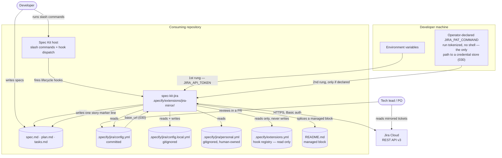
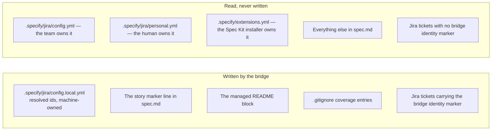
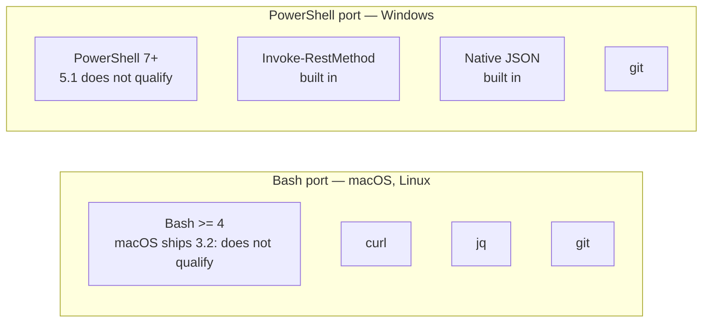

# 1. System context

Who talks to whom, and where every piece of state lives.

## Actors and external systems

## What the extension owns, and what it only borrows

The distinction matters: a reinstall of the extension must never destroy the
operator's configuration, and the bridge must never damage a file another tool
owns.

Two consequences worth internalising:

- **The hook registry has exactly one writer, and it is not this extension.**
  `specify extension add` writes `.specify/extensions.yml` from the manifest's
  top-level `hooks:` block. The bridge only reads and reports on it — a CI test
  (`tests/bash/ci/test_no_registry_write.bats`) fails the build if a writer ever
  comes back. The reason: this port parses a deliberately restricted YAML
  subset that drops comments, so any round-trip would silently damage a file
  the extension neither owns nor can faithfully reproduce.

- **Configuration never lives inside the extension folder.** It lives in
  `.specify/jira/` at the repository root, so `specify extension add --force`
  can wipe and reinstall `.specify/extensions/jira-mirror/` without touching a single
  setting.

## Runtime prerequisites

Checked before anything else happens — no Jira interaction occurs until they
pass, and a failure exits `5` with a named, remediable message.

No build step, no download step, no compiled binary — the scripts in the
repository are what runs.
