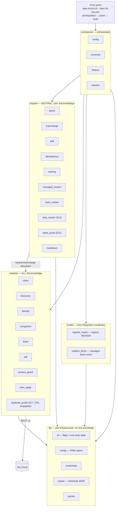
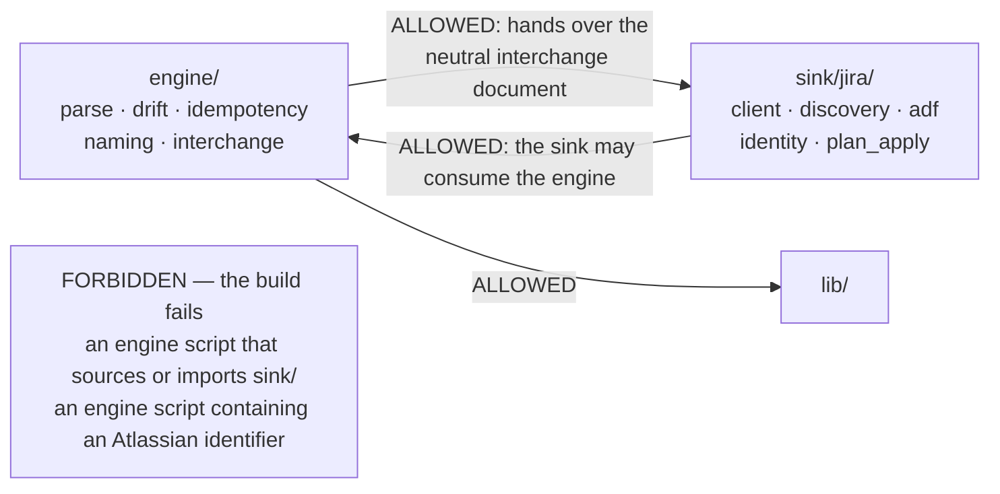
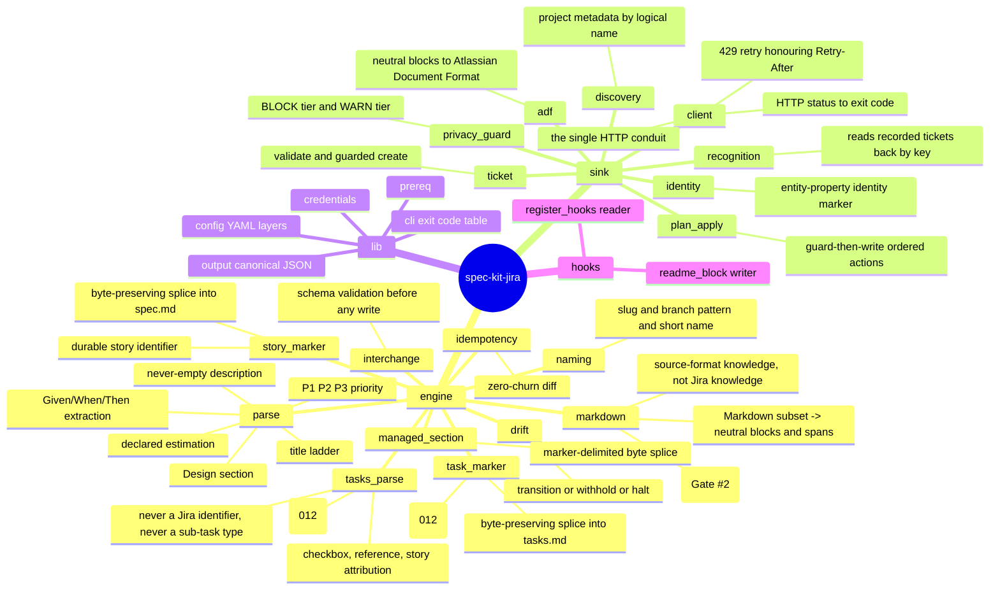
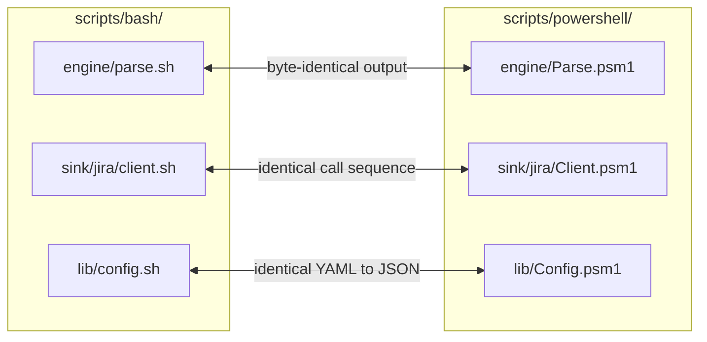
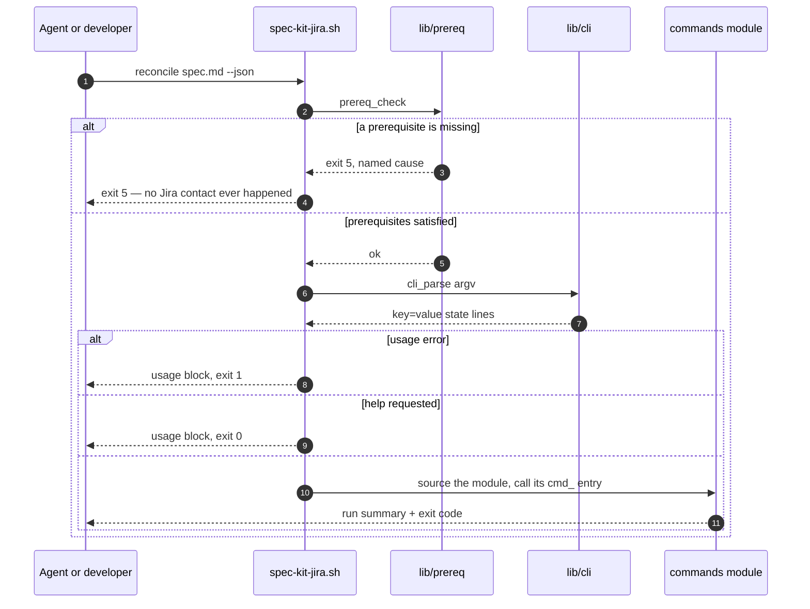

# 2. Module architecture

The bridge is four layers plus a single entry point, mirrored module-for-module
across two native ports.

## The layers

## The one boundary rule that CI enforces

Two greps in `.github/workflows/boundary.yml` block the build:

1. **Gate 1** — no engine script `source`s (Bash) or `Import-Module`s
   (PowerShell) anything under `sink/`.
2. **Gate 2** — no engine script contains an Atlassian-specific identifier:
   issue-key patterns, `atlassian.net`, `createmeta`, ADF node names, Jira
   field ids, or type names.

That is why, for example, `engine/story_marker.sh` generates an opaque hex
identifier and treats the ticket key it is paired with as *opaque text handed
in by the caller* — the engine literally cannot know what a Jira key is. Only
the direction `engine → sink` is forbidden; the sink freely reuses neutral
engine primitives, which is how `sink/jira/adf.sh` can call
`engine/managed_section.sh` to splice a panel into a description.

## Module responsibilities

## Twin ports, module for module

Every Bash module has exactly one PowerShell counterpart, and a CI gate
compares the two leaf sets modulo extension and case.

Anything crossing platforms — files written into the repository, run
summaries, the neutral interchange document — must be **byte-identical**
between ports. That is why `lib/output.sh` reimplements a canonical JSON form
(sorted keys, compact, raw UTF-8, no trailing newline) rather than trusting
each language's native serialiser.

## Entry-point dispatch

The dispatcher sources the command module **on demand**, so a command that
does not exist is a usage error rather than a crash. Prerequisites gate every
path: no Jira interaction is possible before they pass.
