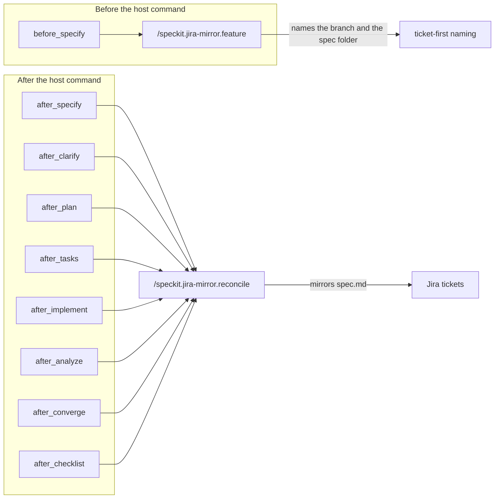
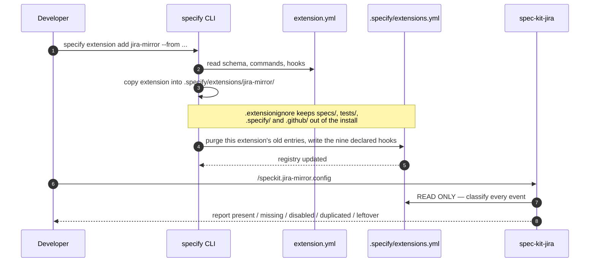
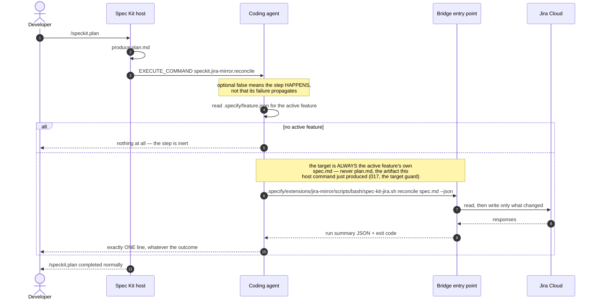
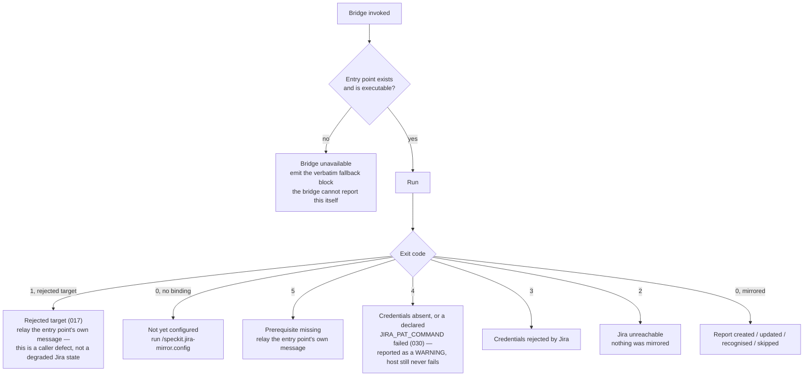
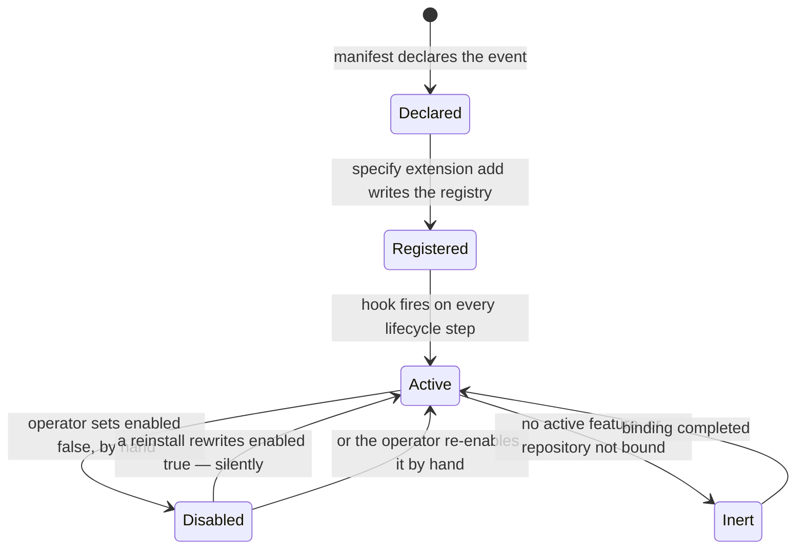

# 3. Lifecycle hooks — how the mirror becomes automatic

The extension is not something you run. Once installed, it runs itself on
every spec-kit lifecycle step.

## The nine declared events

`extension.yml` declares them at the **manifest root** — a sibling of
`provides:`, not nested under it. Placement is load-bearing and its failure
mode is silent: a `hooks:` block nested under `provides:` still validates and
registers nothing at all, which is exactly the defect that once made the whole
extension inert from install.

**`after_converge` and `after_checklist` arrived with 036.** They exist because
the feature's artifacts are published from the reconcile, and two Spec Kit
commands change the feature directory without firing any of the other seven: a
convergence pass rewrites `tasks.md`, and `/speckit.checklist` writes a file
under `checklists/` while `spec.md`, `plan.md` and `tasks.md` stay untouched.
Without these events, that work reached Jira only when some later, unrelated
command happened to fire — which is to say, unpredictably. Both fire
`/speckit.jira-mirror.reconcile`, both are non-optional, and both are accepted
as `phase_status_map` keys like any other event.

**`before_specify` does not always name the feature (029).** A ticket
mentioned with no designator and no prior answer returns a closed reuse
question instead: exit `0`, and deliberately **no** `branch_name` and **no**
`short_name` in the result, not even as `null` — a caller that reads the
result and just proceeds has nothing to proceed with. That is new for any
reader who assumed this hook always produces a name; see
`docs/06-feature-naming.md` for the full decision flow and
`commands/speckit.jira-mirror.feature.md` for the ceremony that answers it.

## Installation — who writes what

The registry purge predicate the host uses is literally
`entry.extension == manifest.id`. A **leftover** entry — one written by a
pre-manifest version of this extension, carrying one of our command names but
no `extension:` field — never satisfies that predicate, so the installer adds
a *second* entry beside it rather than replacing it. Neither the host nor the
bridge can remove it, so the config ceremony reports it with a manual edit
instead of pretending it is not there.

## A hook firing, end to end

Three properties are worth stating explicitly:

- **The agent invokes the bridge by repository-relative path.** The install
  puts nothing on `PATH`; a bare `spec-kit-jira` command does not exist in a
  consuming repository. Assuming it does is what produced the reported
  "spec-kit-jira CLI not installed" message.
- **At most one message per host command run**, naming the true cause.
- **The bridge's exit code never becomes the host's exit code.** It is
  reported, not propagated.

## The seven distinguished causes of a degraded run

The last row of the table in `commands/speckit.jira-mirror.reconcile.md` is the only
cause the bridge cannot report on, because in that state it never starts and
produces nothing. Everything the developer sees then comes from the agent —
which is why that text is fixed in the command document rather than composed
at runtime.

## Disabling an event — and what the bridge no longer guarantees

Setting `enabled: false` on an entry in `.specify/extensions.yml` stops that
event firing. The host honours it; the bridge is not consulted.

**The bridge used to add a second layer**: the configuration ceremony
observed an `enabled: false` entry, recorded it in its own gitignored local
binding, and a dispatch guard exited `0` silently for that event even after a
reinstall had rewritten the registry field back to `true`. That made a
hand-disabled hook permanent.

That layer is gone, deliberately. Constitution X, as amended in 4.0.0, withdrew
it along with the rest of the registry reader:

The consequence is stated here rather than left to be discovered: **a reinstall
may re-enable a hook you disabled by hand, and this extension will neither
prevent it nor report it.** Honouring an operator's decision inside a file the
host owns is the host's obligation to keep. What the bridge gave up in exchange
is the ability to be confidently wrong about that file — the report it used to
emit was observed claiming all seven events missing while the registry plainly
carried them.
