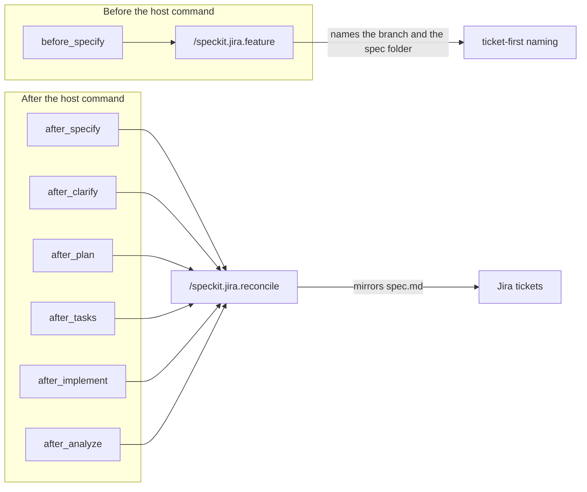
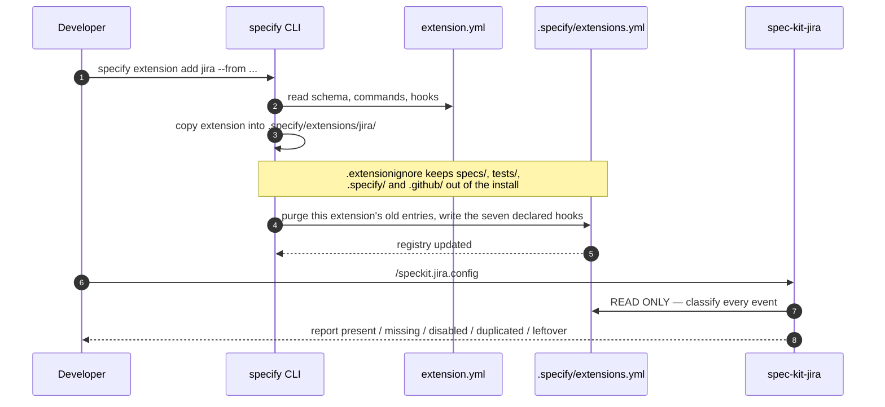
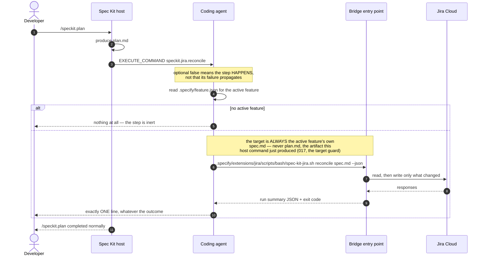
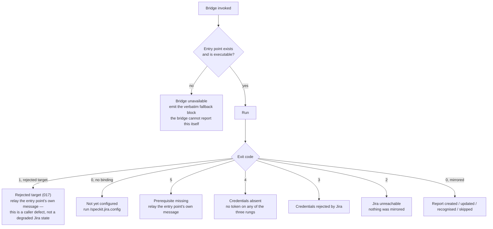
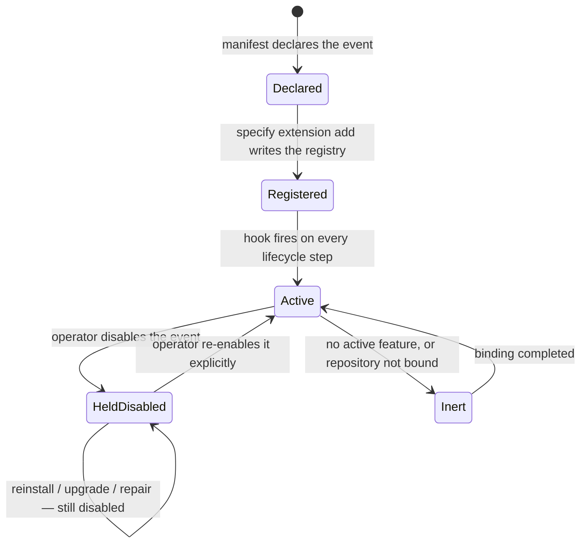

# 3. Lifecycle hooks — how the mirror becomes automatic

The extension is not something you run. Once installed, it runs itself on
every spec-kit lifecycle step.

## The seven declared events

`extension.yml` declares them at the **manifest root** — a sibling of
`provides:`, not nested under it. Placement is load-bearing and its failure
mode is silent: a `hooks:` block nested under `provides:` still validates and
registers nothing at all, which is exactly the defect that once made the whole
extension inert from install.

## Installation — who writes what

The registry purge predicate the host uses is literally
`entry.extension == manifest.id`. A **leftover** entry — one written by a
pre-manifest version of this extension, carrying one of our command names but
no `extension:` field — never satisfies that predicate, so the installer adds
a *second* entry beside it rather than replacing it. Neither the host nor the
bridge can remove it, so the config ceremony reports it with a manual edit
instead of pretending it is not there.

## A hook firing, end to end

Three properties are worth stating explicitly:

- **The agent invokes the bridge by repository-relative path.** The install
  puts nothing on `PATH`; a bare `spec-kit-jira` command does not exist in a
  consuming repository. Assuming it does is what produced the reported
  "spec-kit-jira CLI not installed" message.
- **At most one message per host command run**, naming the true cause.
- **The bridge's exit code never becomes the host's exit code.** It is
  reported, not propagated.

## The seven distinguished causes of a degraded run

The last row of the table in `commands/speckit.jira.reconcile.md` is the only
cause the bridge cannot report on, because in that state it never starts and
produces nothing. Everything the developer sees then comes from the agent —
which is why that text is fixed in the command document rather than composed
at runtime.

## The operator's disable decision

A hook the operator explicitly disabled must be respected **forever**: no
repair and no upgrade may re-enable it. The decision is recorded in the
bridge's own gitignored local binding, not in the registry the installer
rewrites — so a reinstall cannot erase it.

When a run is dispatched for a disabled event, the bridge exits `0`
**silently** — before any prerequisite check, any config read, and any network
call. No warning either: a warning on every single lifecycle command for an
event the operator deliberately turned off is precisely the noise the design
forbids.
