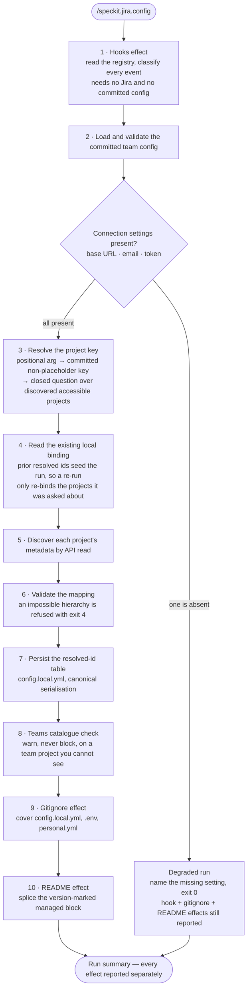
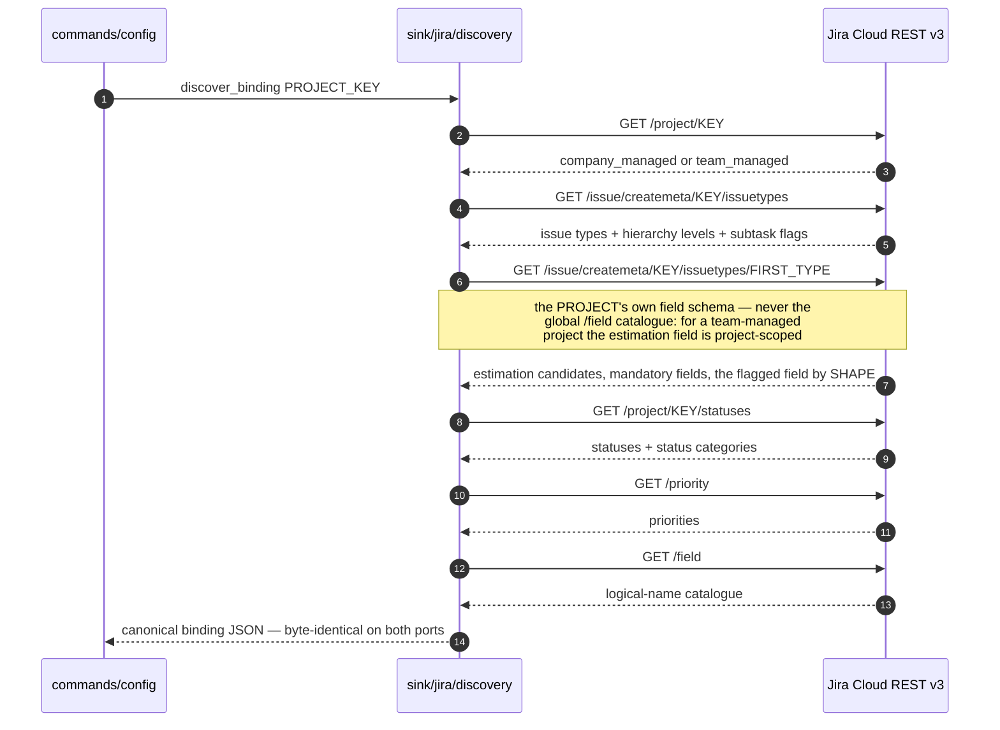
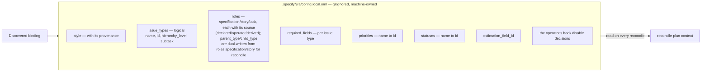
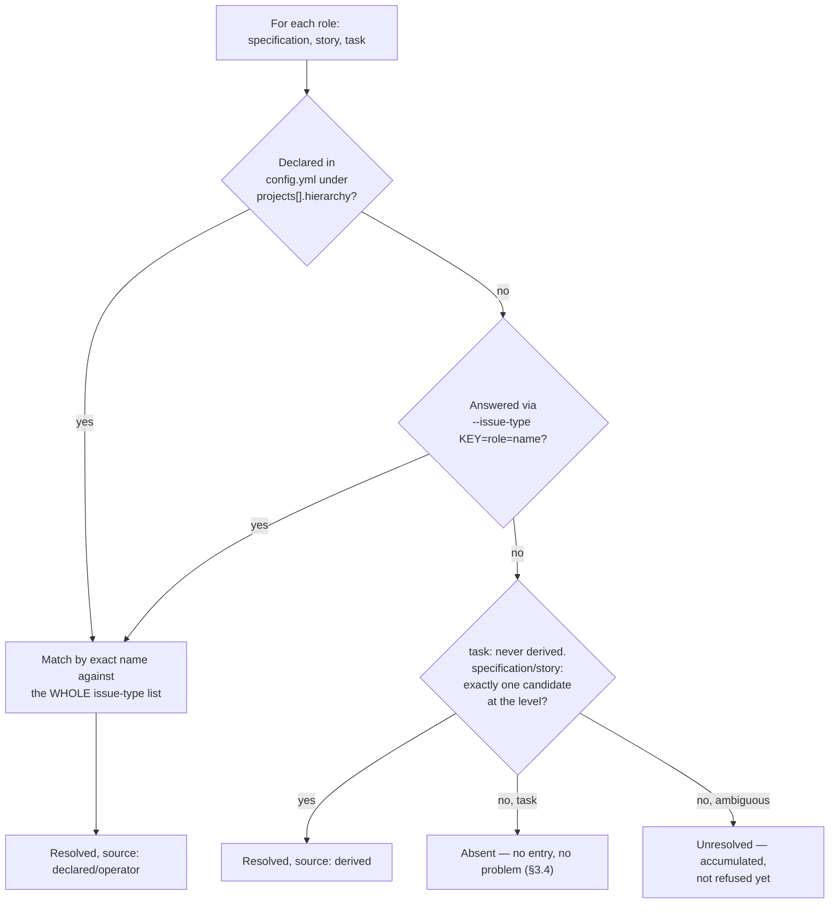
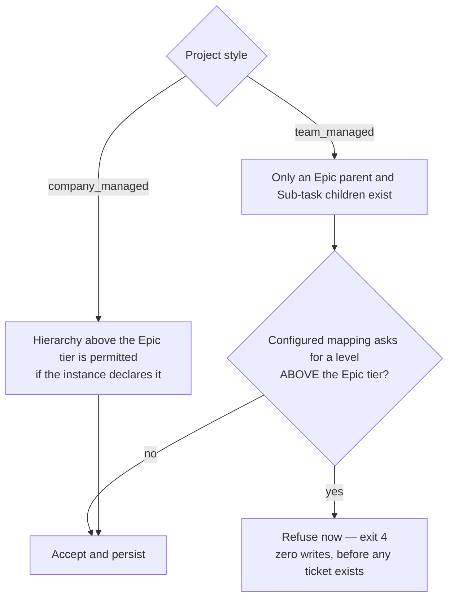
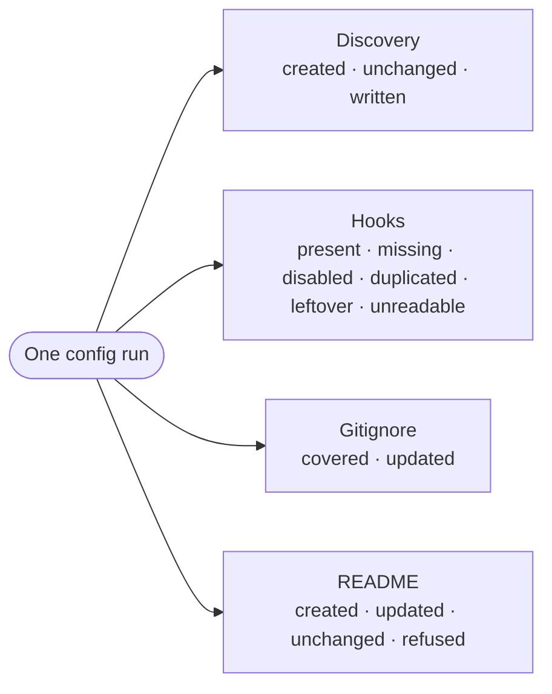

# 4. The config ceremony — `/speckit.jira.config`

The one-command install ceremony. Every step is an API read, a config read, or
a closed enumerated question — **no step is left to model judgement**, and the
`--json` summary plus the resolved-id table make any run reproducible.

## What one run does



## The discovery sequence — nothing about Jira is assumed

Discovery detects the project **style first**, then follows the per-style,
scheme-based path. No default Atlassian type name, status name, or field id is
compiled into the extension anywhere.



The estimation field is **ranked, not assumed**: numeric project fields are
scored by documented signals and the top candidate is proposed to the operator
for confirmation. A fail-closed read at any step prints nothing on stdout and
propagates the transport's mapped exit code.

## What gets written



The serialisation is deterministic: a second run over an unchanged instance
rewrites the file byte-for-byte identically. Each project's ids live under
their own key, so distinct projects never share a namespace.

## Role mapping — declaring which issue type carries the mirror

A Jira instance is not guaranteed to offer exactly one issue type at the
specification tier and one at the story tier. A consumer instance may offer
**Epic** and **Service Category** at the level above Story, and a dozen types
at the story level itself — every one of them a legitimate candidate. Before
this mapping existed, the ceremony refused as soon as it hit the *first*
ambiguous tier, leaving the operator with no way to answer the question the
refusal did not even get to ask.

The resolver evaluates all three roles — `specification`, `story`, `task` —
in **one pass**, with precedence declared → operator → derived:



Every role is evaluated before anything refuses: an unresolved specification
tier and an unresolved story tier are reported **together**, in one run, not
one refusal at a time across repeated re-runs. A name that matches an issue
type of the wrong kind — a sub-task type declared for `story`, say — is
caught by the sub-task check, not reported as an unknown type, so the
message names the actual mistake.

Declare it once your project needs it, in the same business vocabulary as
`priority_map`:

```yaml
projects:
  - key: CONSUMER
    hierarchy:
      specification: Epic
      story: Story
```

or answer it once, per project, without committing anything:

```sh
speckit.jira.config --issue-type CONSUMER=specification=Epic --issue-type CONSUMER=story=Story
```

`--child-type KEY=<name>` remains accepted as the short form of
`--issue-type KEY=story=<name>`. `task` is never derived, even when
unambiguous — declaring or answering it only **records** the sub-task type;
mirroring sub-tasks themselves is a later release.

## Mapping validation — refusing the impossible at config time



The "Epic tier" is identified from the **discovered** binding — the top
non-subtask hierarchy level — never from a name compiled into the script.
Refusing at config time is the whole point: an impossible mapping discovered at
reconcile time would already have created tickets it cannot parent.

## The four effects, reported separately

A run reports what it did to each surface independently, so a partial success
is legible rather than a single opaque "ok".



The README block is spliced through the neutral `engine/managed_section`
byte-splice: only the region between the markers is replaced, every byte
outside it is preserved, the host's dominant line ending is respected, and an
up-to-date block is left byte-for-byte untouched. Malformed markers are refused
with zero writes and exit `4` rather than guessed at.
