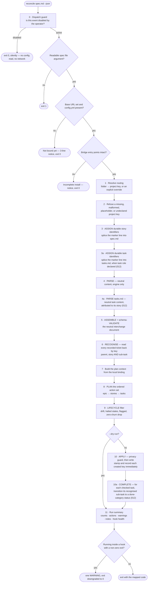
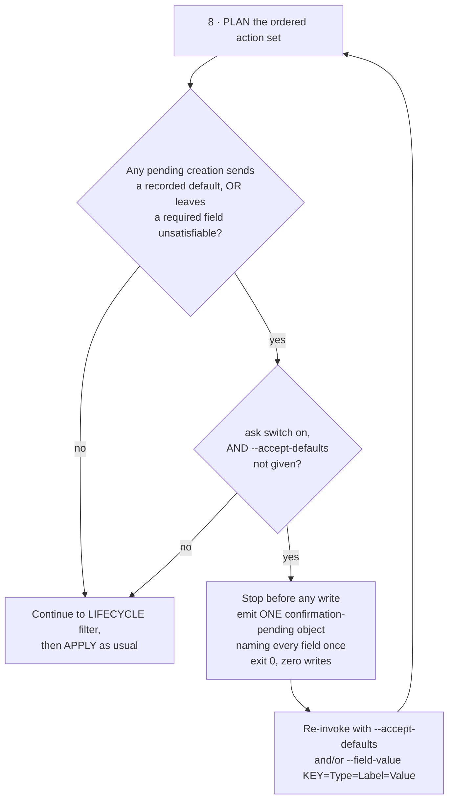
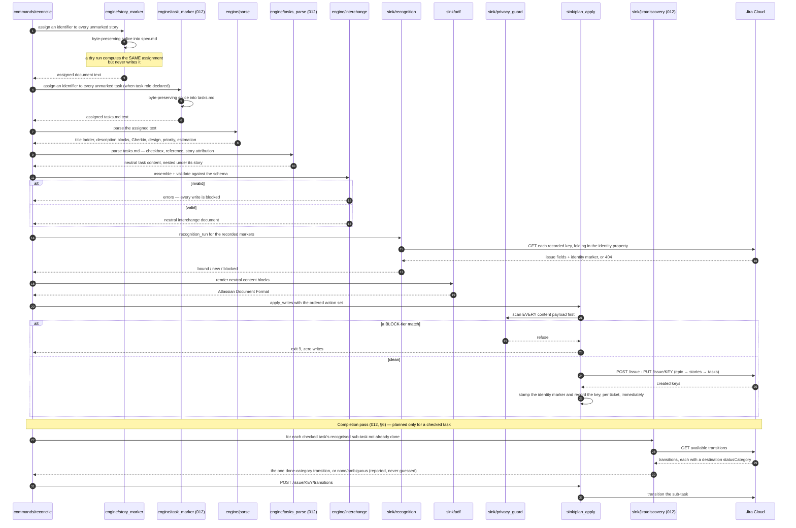
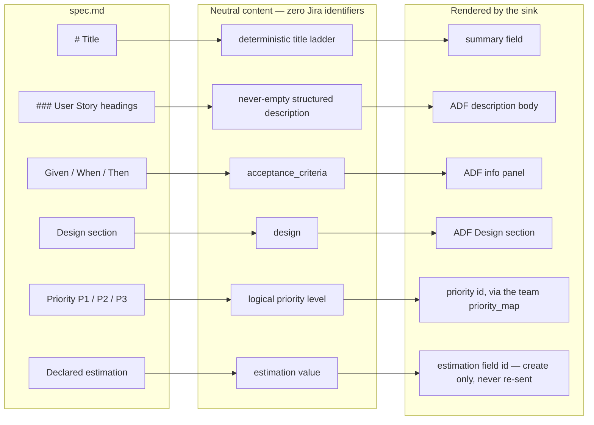
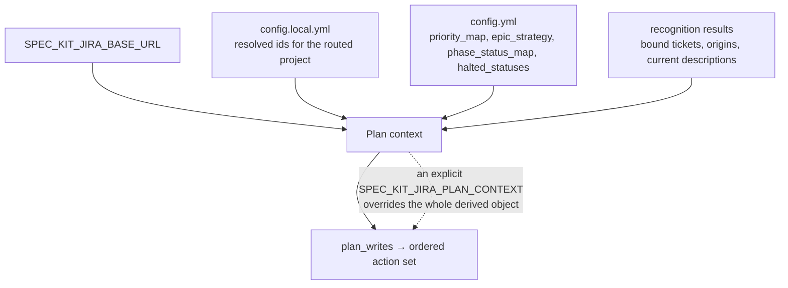
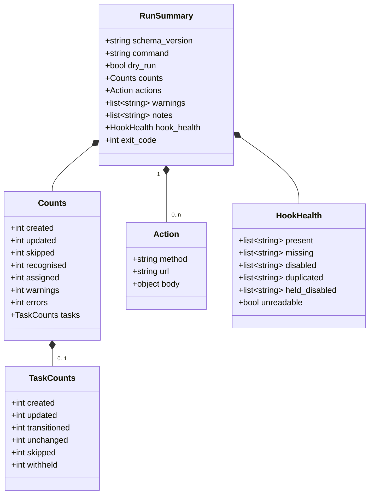

# 5. The reconcile flow — mirroring a specification

`reconcile` is what all six `after_*` hooks fire. It is the largest single
piece of the system, and it reads as one ordered pipeline.

## The pipeline

Every failure between step 1 and step 9 exits with **zero Jira writes**. That
is not incidental: the write path is the last thing that happens, after every
decision has already been made.

## The consolidated field-defaults question (011)

A recorded default makes an otherwise-unsatisfiable required field
satisfiable — the same predicate the config ceremony's gate uses. Before any
write, the planning pass (the exact computation `--dry-run` performs) checks
whether the pending creations would either send a recorded default or still
leave a required field unsatisfiable:

The planning pass and the writing pass are the same code, run twice, never a
second and divergent computation — so a `--dry-run` preview and the run that
follows it can never disagree about a defaulted value. A **decline** is
resumed exactly like an acceptance: re-invoke with `--accept-defaults`; there
is no decline flag. When no answer can be obtained and a required field
stays unsatisfiable, the run refuses for that specification with the
pre-existing exit code and a message carrying the copy-pasteable
`speckit.jira.config --field-default …` remedy line.

A field that is merely *defaultable*, with nothing recorded against it, is
never a trigger — a project that recorded nothing sees no question and no
change in behaviour (FR-028).

## Engine to sink, in sequence

The ordering in the last block is the invariant: **guard, then write**. A single
blocked payload aborts the whole apply — there is no gap through which a leak
could reach Jira.

## What the engine extracts from a specification

The engine emits *logical* content; the sink resolves logical names to ids and
renders ADF. `sink/jira/adf.sh` is the only place ADF node names exist.

## The plan context — the facts the engine cannot know

Four failure states of the context resolve to four distinct, actionable
messages rather than one generic error:

| Situation | Outcome |
|---|---|
| No local binding file at all | Not bound yet — notice, exit `0` |
| Binding exists, this project is not in it | Run `/speckit.jira.config` to discover it — exit `4` |
| Binding predates parent support | The project *is* bound, its binding is a version behind — refresh it, exit `4` |
| Binding unreadable | Fail closed, zero writes — exit `4` |

## The run summary

Structured prose by default, JSON with `--json` — never the other way round.

Two details that make the summary trustworthy:

- **The base URL is stripped** from every reported action URL. The site host is
  a coordinate that must never appear in output.
- **A second, unchanged run reads `created: 0`, `updated: 0`, `recognised` equal
  to the story count, and `skipped` equal to it too.** That is the correct
  signature of an idempotent re-run, not a failure to mirror anything.
- **`counts.tasks` appears only when a `task` role is declared** — absence,
  not a zeroed-out object, is the off switch that keeps a run with no task
  tier byte-for-byte identical to before feature 012 (FR-011). Its own
  `transitioned` count is never folded into `updated`: a completion is a
  transition, not a content change (research R5).
