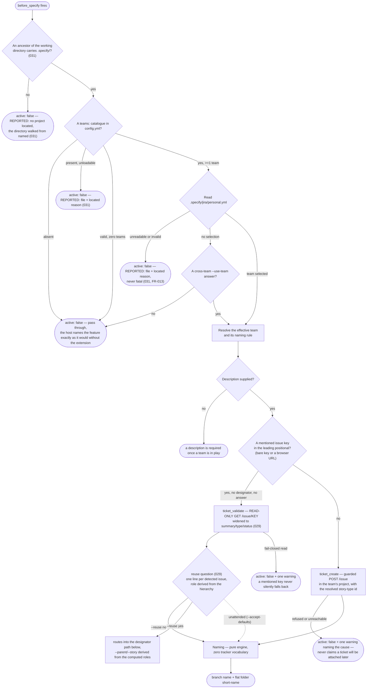
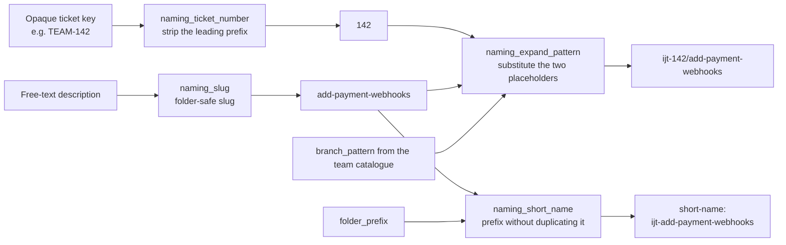
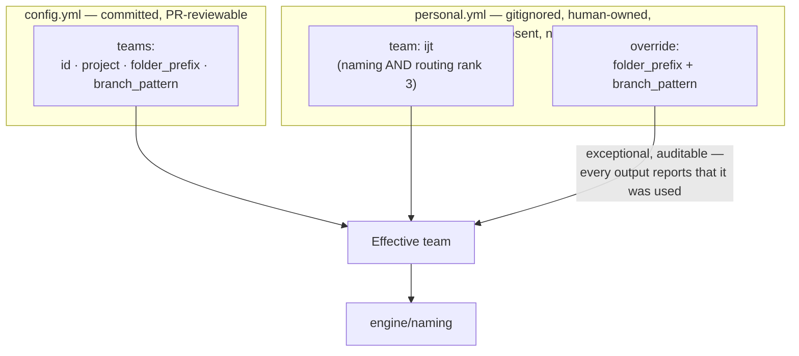
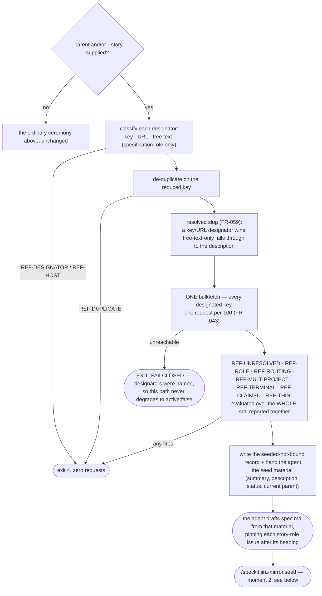
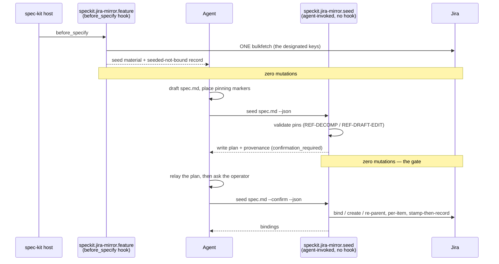

# 6. Feature naming — the ticket-first ceremony

`/speckit.jira-mirror.feature` is the `before_specify` hook. It resolves the Jira
ticket **before** naming anything, so the branch and the spec folder can carry
the real ticket number instead of a placeholder that has to be renamed later.

## The flow

Non-blocking by construction: no team selected means `{active:false}`; Jira
unreachable or a create refused means `{active:false}` plus one warning naming
the cause. The host `specify` flow then proceeds exactly as it does today. A
ticket named in a repository with no applicable team configuration is told so
— the file to fix and the command that fixes it — rather than met with
silence (029, FR-026).

### Every `{active:false}` names which of seven states produced it (031)

Before 031, `{active:false}` was a single, undifferentiated outcome — an
operator whose `config.yml` had a typo saw exactly the same nothing as an
operator who had never adopted the extension at all. The pass-through now
carries that distinction:

| State | Reported by default? |
| --- | --- |
| No `config.yml` at the resolved directory | silent |
| `config.yml` present, fails to load | **reported** — file + located reason |
| Valid `config.yml`, `teams:` declares zero entries | silent (a supported single-project setup) |
| No `personal.yml` | silent |
| `personal.yml` present, no `team` key | silent |
| `personal.yml` present, fails to load | **reported** — file + located reason, never fatal |
| No ancestor of the working directory carries `.specify/` | **reported** — the directory walked from |

Two of the seven speak without being asked, because a file that exists is a
statement its author is owed an answer about, and a file that does not exist
is not a statement. All seven are nameable on request: `--verbose` names the
resolution state, the absolute directory consulted, and what would change it
— without moving the default or `--json` output by one line or one key.

**The mentioned key is a naming input, and the operator is asked whether it
is also a binding (029).** `ticket_validate` is read-only, and answering the
reuse question with "create new" (or letting it fall through unattended)
leaves `spec.md` unlinked at `before_specify`: the following `reconcile` finds
an unbound specification and creates a new parent plus one issue per user
story, alongside the mentioned ticket — exactly as today, and exactly what
answering "reuse" avoids. Seeding a specification from an issue that already
exists is the designator path below, reached either by answering the
question or by naming `--parent`/`--story` directly, and it is chosen **at
invocation time**: a feature already created without either cannot be seeded
after the fact (`REF-EXISTS`).

## The naming engine — four pure string operations

Two rules make this predictable:

- A `/` inside the pattern is preserved verbatim — it creates branch hierarchy
  and nothing else.
- The folder short-name is **always a single flat component**, whatever the
  branch pattern looks like.

The short-name is not yet the folder name: the host prefixes its own feature
number, so `ijt-add-payment-webhooks` lands on disk as
`specs/001-ijt-add-payment-webhooks`. That numbering belongs to spec-kit and
has no flag to suppress it.

### Who creates the branch — the extension does not

Both strings above are **outputs**. This extension names; it does not act on
the repository. The host's `create-new-feature.sh` (spec-kit 0.13.x) creates
the spec folder and an empty `spec.md`, and runs no git command at all — so the
branch is created by whichever `before_specify` hook the repository registers
for that job, dispatched after this one.

`branch_name` reaches it through **`GIT_BRANCH_NAME`** — the **host's** own
documented channel for using a branch name verbatim, "bypassing all
prefix/suffix generation". The agent that sequences the hooks is what exports
it; without that export the receiving hook regenerates a name of its own and
the ticket number is lost from the branch.

**This is a convention, not a dependency.** The extension names no counterpart
in its manifest, detects none at run time, and behaves identically when none is
installed — `branch_name` is simply emitted and unused. What it depends on is
`GIT_BRANCH_NAME`, which belongs to spec-kit, the host already declared in
`requires:`. The commonly installed git extension happens to read that variable
in both of its ports, which is why the convention works in practice; if it is
absent, or replaced, or renamed, nothing here breaks.

One trap worth knowing: with a git extension installed there are two scripts
called `create-new-feature.sh` doing opposite halves of the job — the host's
makes the folder and runs no git, the extension's makes the branch and no
folder. Anything invoking one by bare name is ambiguous. Widening this hook to create the branch itself is what let a
single dispatch absorb the whole specify command in the 2026-08-22 consumer
incident; the boundary is stated normatively in
`commands/speckit.jira-mirror.feature.md`.

The module carries no key-shaped literal and no tracker vocabulary at all; a
boundary grep in the suite proves it. `naming_ticket_number` does not know what
a Jira key is — it strips an upper-case-led prefix from an opaque string, and
returns anything that is not prefix-shaped unchanged.

## Where the naming rules come from

The catalogue is the team's shared decision, reviewed in a pull request. The
selection is personal and gitignored, so two developers on the same repository
can ship under different conventions without editing a committed file. The
override exists for the exceptional case and is reported every time it fires,
so it can never quietly become the norm.

## Naming from named issues — the designator flags (027)

`--parent` and `--story` extend `/speckit.jira-mirror.feature` past the mentioned-key
case above: instead of naming (or leaving unnamed) a single ticket, the
operator can name a whole set of **existing** Jira issues that already carry
the human intent for this feature, and seed `spec.md` from their content
rather than draft it from scratch. **Two ways in (029):** type the flags from
the start, or paste bare keys and answer the reuse question with `yes` — the
bridge derives the same flags from the roles it already computed. A type the
declared hierarchy maps to no role is proposed in the story role rather than
refused, and needs no parent; a type that collides with the *other* role
refuses instead, naming both types, before either answer is given.

A key or a browser URL resolves to an existing issue and is **adopted**, never
created. A specification-role designator supplied as free text is never
resolved against Jira at all (no lookup of any kind) — it is always the title
of a parent to **create**, deferred to `/speckit.jira-mirror.seed --confirm`.

## The two-moment flow

Seeding from named issues splits into two moments because a confirmation
prompt cannot live in a lifecycle hook (Constitution IV — "a wait is
indistinguishable from a hang").

A decline (or an unattended run) leaves the **seeded-not-bound** state exactly
as it was: the folder and `spec.md` exist, the pinning markers are still
`pin=`, and no identity marker exists on either side. Re-invoking
`speckit.jira-mirror.seed` with the same designator set resumes at the gate — it
re-reads Jira to recompute the plan (a story closed or re-parented in the
meantime shows up), but it **never** re-drafts `spec.md`. A different
designator set refuses `REF-RESEED`.

See `commands/speckit.jira-mirror.seed.md` for the full agent-facing procedure and
`docs/08-safety-model.md` for the seeded-not-bound state machine and the
pinning marker's consume-at-binding mechanics.

## What `team:` governs, beyond naming

Since 033 the `team:` key of `personal.yml` governs **two** things, and this
document describes only the first:

1. **Naming** — the folder prefix and branch pattern a new feature is created
   under, taken from that team's catalogue entry. That is everything below.
2. **Routing** — where a specification is mirrored when no committed `routing:`
   rule and no committed team folder prefix places it. The selected team's
   project is rank 3 of four, ahead of `config.yml`'s `routing_default`, so a
   repository shared by several teams never mirrors one team's work into
   another's. See `docs/07-configuration-and-secrets.md`, "Routing: four ranks".

The routing half applies only while a specification is still unbound. Once its
stories carry ticket markers the specification fixes its own project, and
changing this key will not move it.
