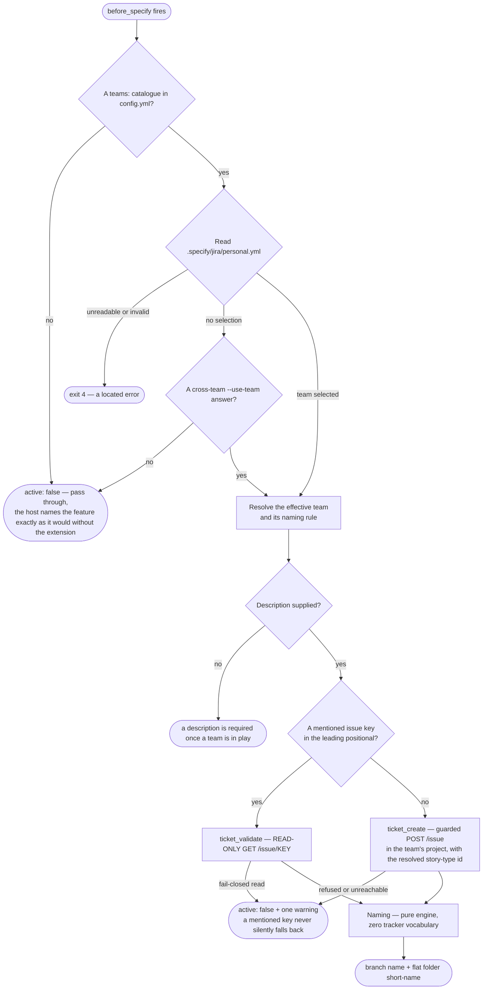
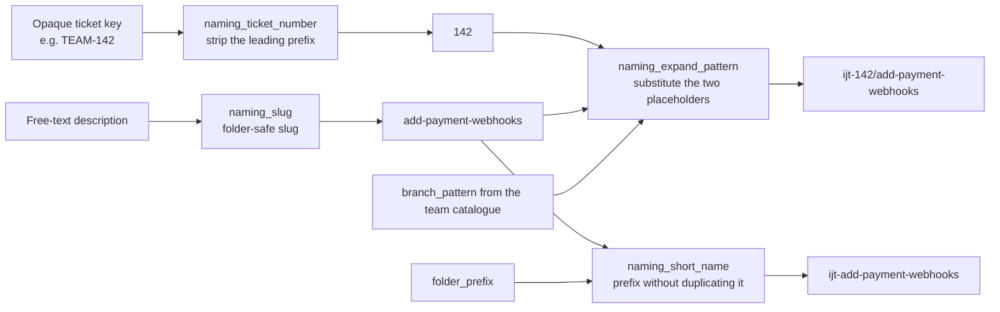
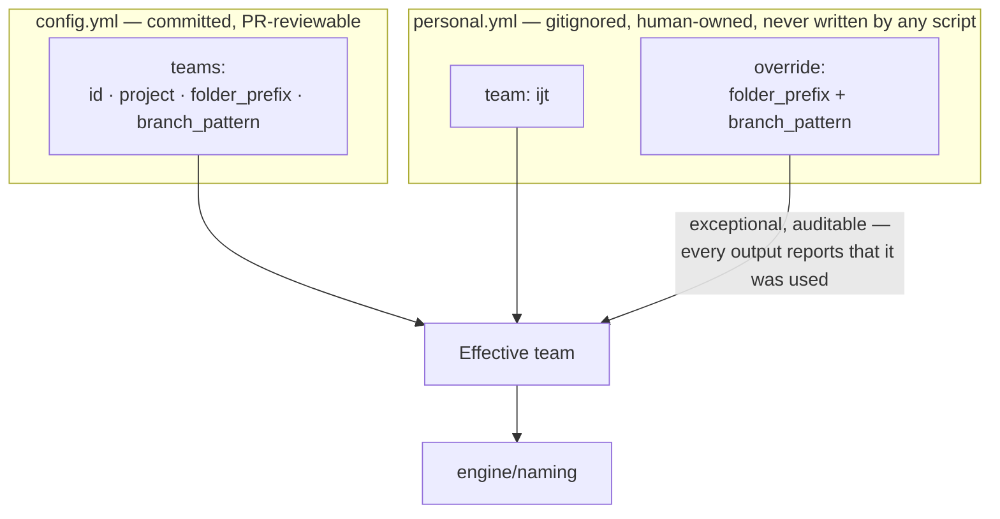

# 6. Feature naming — the ticket-first ceremony

`/speckit.jira.feature` is the `before_specify` hook. It resolves the Jira
ticket **before** naming anything, so the branch and the spec folder can carry
the real ticket number instead of a placeholder that has to be renamed later.

## The flow

Non-blocking by construction: no team selected means `{active:false}`; Jira
unreachable or a create refused means `{active:false}` plus one warning. The
host `specify` flow then proceeds exactly as it does today.

## The naming engine — four pure string operations

Two rules make this predictable:

- A `/` inside the pattern is preserved verbatim — it creates branch hierarchy
  and nothing else.
- The folder short-name is **always a single flat component**, whatever the
  branch pattern looks like.

The module carries no key-shaped literal and no tracker vocabulary at all; a
boundary grep in the suite proves it. `naming_ticket_number` does not know what
a Jira key is — it strips an upper-case-led prefix from an opaque string, and
returns anything that is not prefix-shaped unchanged.

## Where the naming rules come from

The catalogue is the team's shared decision, reviewed in a pull request. The
selection is personal and gitignored, so two developers on the same repository
can ship under different conventions without editing a committed file. The
override exists for the exceptional case and is reported every time it fires,
so it can never quietly become the norm.
