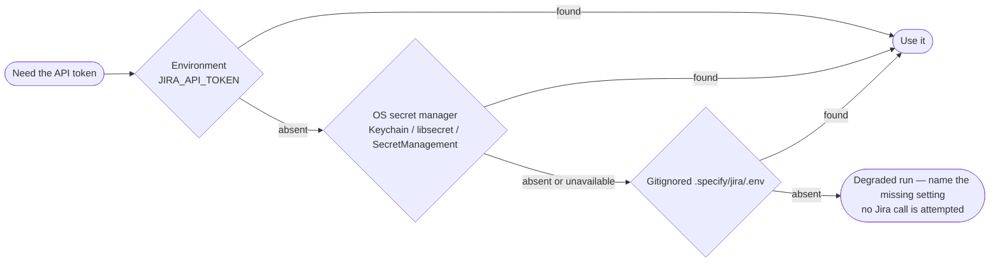
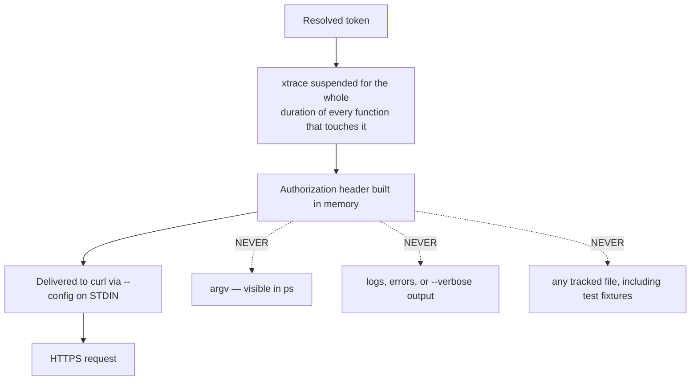
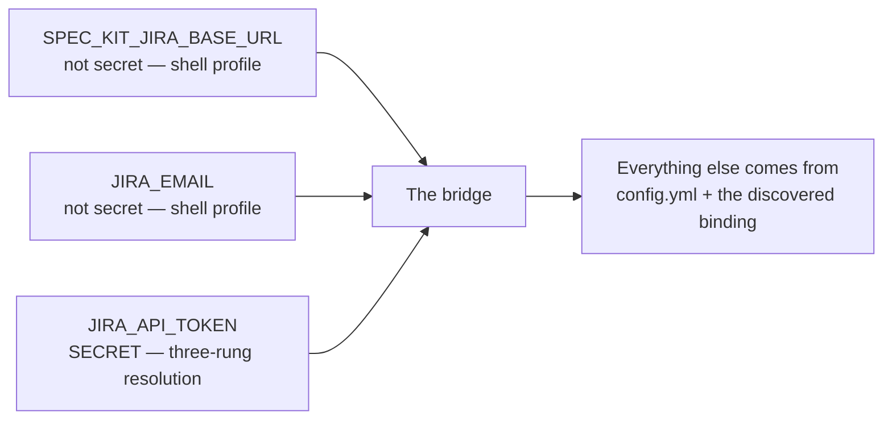
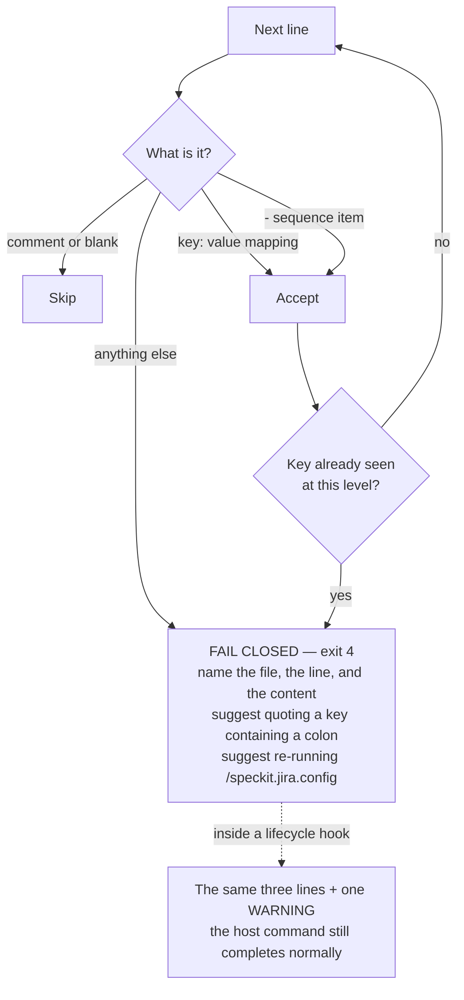

# 7. Configuration and secrets

Three strictly separate layers, and a credential that never enters the tree.

## The three layers

```mermaid
flowchart TB
    subgraph L1["1 · Team config — COMMITTABLE"]
        A[".specify/jira/config.yml"]
        A1["projects · epic_strategy · task_strategy"]
        A2["priority_map · estimation_field · hierarchy"]
        A3["routing + routing_default"]
        A4["teams catalogue"]
        A5["privacy.allowlist"]
        A6["phase_status_map · halted_statuses"]
        A7["task_mirror per project (022) — subtask | checklist"]
    end

    subgraph L2["2 · Local binding — GITIGNORED, machine-owned"]
        B[".specify/jira/config.local.yml"]
        B1["resolved_ids per project"]
        B2["issue types, resolved roles (specification/story/task),<br/>each with its provenance"]
        B3["priorities · statuses · estimation field id"]
        B4["the operator's hook disable decisions"]
    end

    subgraph L3["3 · Personal + secrets — GITIGNORED"]
        C[".specify/jira/personal.yml — human-owned"]
        D[".specify/jira/.env — JIRA_API_TOKEN only"]
    end

    subgraph L4["4 · Run-state cache (021) — GITIGNORED, machine-owned"]
        E[".specify/jira/state/&lt;feature&gt;.json"]
        E1["hashes of the local inputs a run<br/>saw last time it fully succeeded"]
    end

    A -->|"logical names"| Resolve["Reconcile"]
    B -->|"resolved ids"| Resolve
    C -->|"team selection"| Feature["Feature naming"]
    D -->|"3rd credential rung"| Sink["sink/jira/client"]
    Resolve -->|"records on success"| E
```

The run-state cache is not a fourth configuration layer — it holds no setting
an operator sets, only hashes `run_state_record` computes from the other
three's own inputs plus `spec.md`/`tasks.md`. It is machine-owned and never
committed, self-ignoring through the `*` `.gitignore` `run_state_record`
writes beside it the first time it creates the directory, and it never holds
a credential (FR-019, Constitution V). See
[`contracts/run-state.md`](../specs/021-reconcile-performance/contracts/run-state.md) for what it
records and why staleness there is an accepted trade, not a bug.

Rules that hold across all three:

- **The team layer must stay credential-free.** A value shaped like an
  Atlassian token, a real `*.atlassian.net` host, or an email address is
  refused with exit `4` — and the offending value is never echoed back.
- **Nothing lives inside `.specify/extensions/`.** A reinstall or upgrade of the
  extension must never be able to destroy the operator's configuration.
- **Keys use business language**, not Jira internals: `epic_strategy: per_feature`,
  never an opaque id where a logical name exists. A tech lead should be able to
  review their team's config without opening the documentation.

## Credential resolution — three rungs, in order

All three platforms share the same three-rung shape. On Windows, the second rung
reads `Get-Secret -Name spec-kit-jira -AsPlainText` from the registered
PowerShell SecretManagement default vault — see `INSTALL.md` for
`Install-Module`/`Register-SecretVault`/`Set-Secret` setup. The rung is
soft-optional everywhere (constitution v1.3.0): the module absent, no vault
registered, no entry named `spec-kit-jira`, or a locked vault all fall through
silently to the gitignored `.env`, without an error and without waiting.

## How the token is protected in flight

The `set +x` bracket uses a **function-local** saved state, never a global, so
nested calls cannot clobber each other's tracing state. The guard stays down
through the final emptiness test — xtrace is only restored once no token value
remains live.

## The three connection settings

Only three, and only one of them is secret:

Once those three are in place and the repository is bound, mirroring needs **no
further environment variables**: the target project, issue type, and priority
are all resolved from the config and the binding.

If the lifecycle hooks cannot see the two non-secret settings — the hooks run
in the shell the agent spawns, which does not always load a profile — declare
them per project in `.claude/settings.json` under `env`. The token stays in the
Keychain, the keyring, or the gitignored `.env`; it never goes in that file.

## Reading a YAML file, fail-closed

All four configuration surfaces — `config.yml`, `config.local.yml`,
`personal.yml`, and the host's `.specify/extensions.yml` — go through the same
restricted YAML reader. The Bash port ships no `yq` (runtime dependencies are
`curl`, `jq`, `git` only), so it parses exactly the dialect the config command
writes and the self-documenting template teaches.

**A `reconcile` run reads each source at most once.** Every caller of the
reader that asks for the same path again in the same run — `config_load`'s
own team/local merge, the gate phase's persisted-binding read, and the
apply phase's hook-health check all separately need `config.local.yml` — is
served the first parse's result rather than re-opening the file. The
consequence: the resolved configuration is a **per-process snapshot**. If
something else edits `config.local.yml` (or any of the other three surfaces)
partway through a `reconcile` run, that edit is not observed until the
*next* run — the same way an already-resolved environment variable
wouldn't be. A malformed source is never cached, so a still-broken file
keeps failing (and reporting) on every read that reaches it.

Supported: 2-space block indentation, `key: value` mappings, `- ` sequences,
plain / single- / double-quoted scalars, `true` / `false` / `null`, `#`
comments, blank lines. Out of scope by design: flow collections and anchors.

Failing closed rather than silently dropping the rest of the file is the point:
a partially-read config would mirror into the wrong project with the wrong
mapping, and nobody would find out until the tickets existed.

## Writing configuration, fail-closed

The writer escapes `"` and `\` inside every quoted scalar it emits (`\"` and
`\\`), so a Jira label or value containing either round-trips through
`config.local.yml` unchanged. Only a string value containing a line break
refuses the write — at exit `4`, naming the offending path — because this
restricted YAML dialect has no way to represent one.
