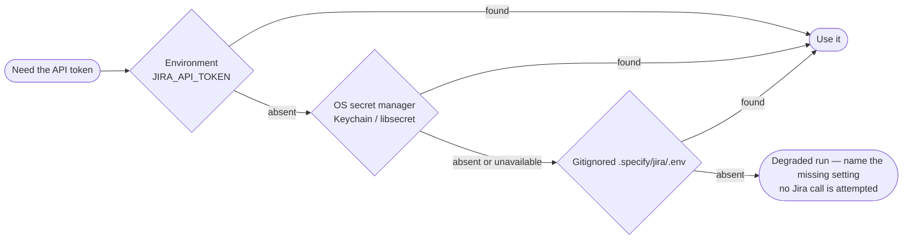
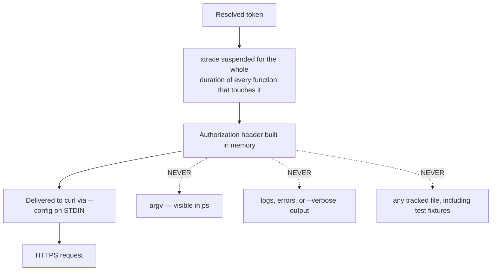
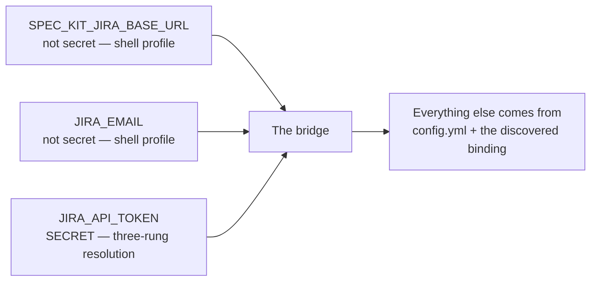
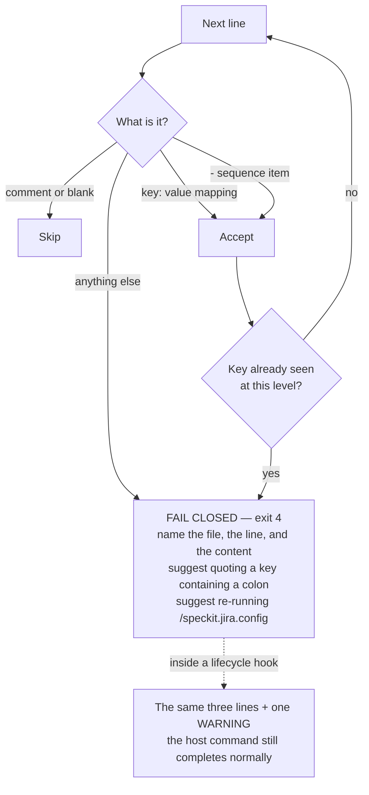

# 7. Configuration and secrets

Three strictly separate layers, and a credential that never enters the tree.

## The three layers

```mermaid
flowchart TB
    subgraph L1["1 · Team config — COMMITTABLE"]
        A[".specify/jira/config.yml"]
        A1["projects · epic_strategy · task_strategy"]
        A2["priority_map · estimation_field"]
        A3["routing + routing_default"]
        A4["teams catalogue"]
        A5["privacy.allowlist"]
        A6["phase_status_map · halted_statuses"]
    end

    subgraph L2["2 · Local binding — GITIGNORED, machine-owned"]
        B[".specify/jira/config.local.yml"]
        B1["resolved_ids per project"]
        B2["issue types, hierarchy, parent/child"]
        B3["priorities · statuses · estimation field id"]
        B4["the operator's hook disable decisions"]
    end

    subgraph L3["3 · Personal + secrets — GITIGNORED"]
        C[".specify/jira/personal.yml — human-owned"]
        D[".specify/jira/.env — JIRA_API_TOKEN only"]
    end

    A -->|"logical names"| Resolve["Reconcile"]
    B -->|"resolved ids"| Resolve
    C -->|"team selection"| Feature["Feature naming"]
    D -->|"3rd credential rung"| Sink["sink/jira/client"]
```

Rules that hold across all three:

- **The team layer must stay credential-free.** A value shaped like an
  Atlassian token, a real `*.atlassian.net` host, or an email address is
  refused with exit `4` — and the offending value is never echoed back.
- **Nothing lives inside `.specify/extensions/`.** A reinstall or upgrade of the
  extension must never be able to destroy the operator's configuration.
- **Keys use business language**, not Jira internals: `epic_strategy: per_feature`,
  never an opaque id where a logical name exists. A tech lead should be able to
  review their team's config without opening the documentation.

## Credential resolution — three rungs, in order

Platform note: **there is no OS secret-manager rung on Windows.** The
PowerShell port's `Get-JiraSecretManagerToken` is a deliberate no-op, so the
token must come from the environment or the gitignored `.env`. Putting it in
the Windows Credential Manager does nothing — nothing reads from there.

## How the token is protected in flight

The `set +x` bracket uses a **function-local** saved state, never a global, so
nested calls cannot clobber each other's tracing state. The guard stays down
through the final emptiness test — xtrace is only restored once no token value
remains live.

## The three connection settings

Only three, and only one of them is secret:

Once those three are in place and the repository is bound, mirroring needs **no
further environment variables**: the target project, issue type, and priority
are all resolved from the config and the binding.

If the lifecycle hooks cannot see the two non-secret settings — the hooks run
in the shell the agent spawns, which does not always load a profile — declare
them per project in `.claude/settings.json` under `env`. The token stays in the
Keychain, the keyring, or the gitignored `.env`; it never goes in that file.

## Reading a YAML file, fail-closed

All four configuration surfaces — `config.yml`, `config.local.yml`,
`personal.yml`, and the host's `.specify/extensions.yml` — go through the same
restricted YAML reader. The Bash port ships no `yq` (runtime dependencies are
`curl`, `jq`, `git` only), so it parses exactly the dialect the config command
writes and the self-documenting template teaches.

Supported: 2-space block indentation, `key: value` mappings, `- ` sequences,
plain / single- / double-quoted scalars, `true` / `false` / `null`, `#`
comments, blank lines. Out of scope by design: flow collections and anchors.

Failing closed rather than silently dropping the rest of the file is the point:
a partially-read config would mirror into the wrong project with the wrong
mapping, and nobody would find out until the tickets existed.
