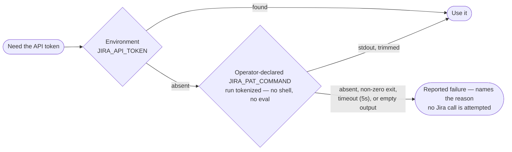
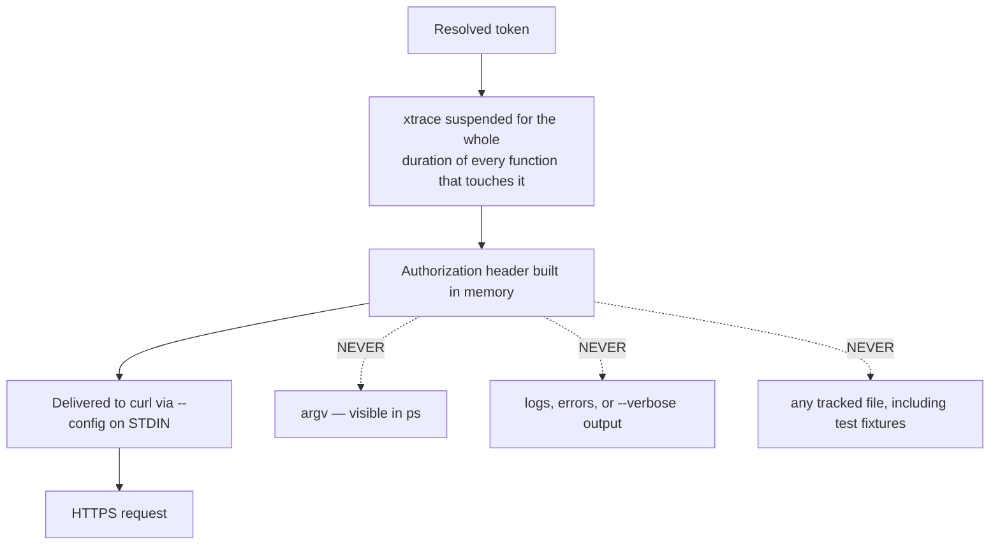
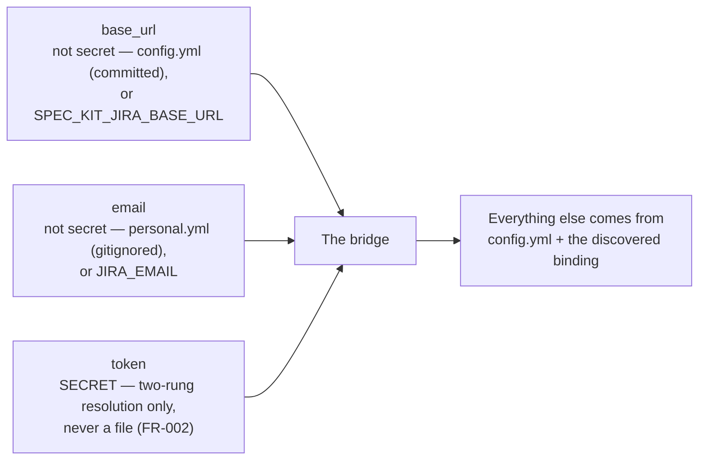
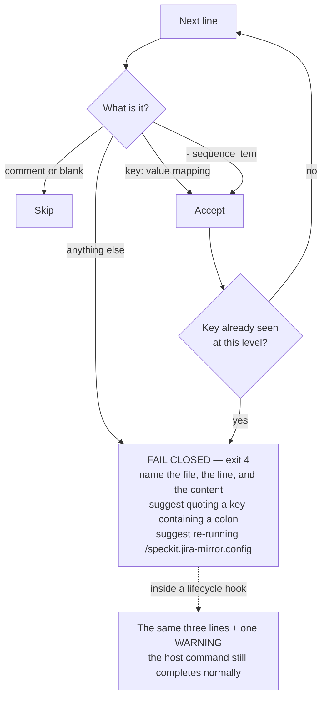

# 7. Configuration and secrets

Three strictly separate layers, and a credential that never enters the tree.

## The three layers

```mermaid
flowchart TB
    subgraph L1["1 · Team config — COMMITTABLE"]
        A[".specify/jira/config.yml"]
        A1["projects · epic_strategy · task_strategy"]
        A2["priority_map · estimation_field · hierarchy"]
        A3["routing + routing_default (OPTIONAL since 033)<br/>outranked by a spec's own markers since 035"]
        A4["teams catalogue"]
        A5["privacy.allowlist"]
        A6["phase_status_map (per role since 023) · halted_statuses"]
        A7["task_mirror per project (022) — subtask | checklist"]
        A8["base_url (030) — the Jira site, committed"]
    end

    subgraph L2["2 · Local binding — GITIGNORED, machine-owned"]
        B[".specify/jira/config.local.yml"]
        B1["resolved_ids per project"]
        B2["issue types, resolved roles (specification/story/task),<br/>each with its provenance"]
        B3["priorities · statuses · estimation field id"]
        B4["the operator's hook disable decisions"]
    end

    subgraph L3["3 · Personal — GITIGNORED, human-owned"]
        C[".specify/jira/personal.yml"]
        C1["team selection · email (030)"]
        Leftover[".specify/jira/.env — leftover only (030)<br/>never read; the ignore rule stays so an<br/>older install's file is never un-ignored"]
    end

    subgraph L4["4 · Run-state cache (021) — GITIGNORED, machine-owned"]
        E[".specify/jira/state/&lt;feature&gt;.json"]
        E1["hashes of the local inputs a run<br/>saw last time it fully succeeded"]
    end

    A -->|"logical names"| Resolve["Reconcile"]
    A -->|"base_url"| Sink["sink/jira/client"]
    B -->|"resolved ids"| Resolve
    C -->|"team selection"| Feature["Feature naming"]
    C -->|"email"| Sink
    Resolve -->|"records on success"| E
```

The run-state cache is not a fourth configuration layer — it holds no setting
an operator sets, only hashes `run_state_record` computes from the other
three's own inputs plus `spec.md`/`tasks.md`. It is machine-owned and never
committed, self-ignoring through the `*` `.gitignore` `run_state_record`
writes beside it the first time it creates the directory, and it never holds
a credential (FR-019, Constitution V). See
[`contracts/run-state.md`](../specs/021-reconcile-performance/contracts/run-state.md) for what it
records and why staleness there is an accepted trade, not a bug.

Rules that hold across all three:

- **The team layer must stay credential-free.** A value shaped like an
  Atlassian token, a real `*.atlassian.net` host, or an email address is
  refused with exit `4` — and the offending value is never echoed back.
- **Nothing lives inside `.specify/extensions/`.** A reinstall or upgrade of the
  extension must never be able to destroy the operator's configuration.
- **Keys use business language**, not Jira internals: `epic_strategy: per_feature`,
  never an opaque id where a logical name exists. A tech lead should be able to
  review their team's config without opening the documentation.

### Routing: four ranks, first one that answers wins

A specification reconciles against exactly ONE project, resolved in this order
(035, `specs/035-routing-follows-bindings/contracts/marker-routing.md`, which
amends 033's four-rank chain):

| Rank | Source | Layer | Matched against |
| --- | --- | --- | --- |
| 1 | a `routing:` rule | committed | the **raw** folder name, numbering included |
| 2 | a `teams:` `folder_prefix` | committed | the folder name with its leading `NNN-` removed |
| 3 | the project the specification's own `ticket=` markers record | the specification itself | — it is where this specification already lives |
| 4 | the developer's `team:` selection | **gitignored** `personal.yml` | — it is about the person, not the specification |
| 5 | `routing_default` | committed | — the repository's stated last resort |

Nothing answers: the run is refused with exit 4 and zero writes, and the message
reports what each rank found rather than naming one missing key.

Three properties of that order are load-bearing.

**Ranks 1 and 2 outrank everything below them, always.** They are committed
decisions about where a specification BELONGS, and a team must remain able to
move one. Rank 3 reports only where it currently LIVES; rank 4 is about whoever
is running the command. A gitignored file must never override a team's committed
routing decision — that would be the same imposition rank 4 exists to remove,
pointed the other way.

**Rank 3 is what makes a bound specification stable.** Once any marker carries a
ticket, the specification itself records which project it lives in, and that
record decides for every developer whatever team each has selected. 033 already
said this and did not do it: it suppressed rank 4 for a bound specification,
citing that record, and then never read it — so resolution fell through to
`routing_default`, free to name a different project, and the second reconcile of
a specification planned a duplicate ticket set somewhere else. 035 reads it.

**A specification is never moved between projects by the bridge.** Where the
routed project ends up differing from the one the markers record — a team
changed a committed rule, or an operator supplied an explicit project override —
the run refuses with zero writes and names both projects. Moving a whole
specification is effectively irreversible and strands a complete ticket set;
having it fire as a side effect of a configuration edit is exactly the surprise
035 exists to remove. Route the specification back, or clear its `ticket=`
markers deliberately.

`routing_default` became OPTIONAL in 033. A repository shared by several teams
can omit it — there is no value that is correct for all of them — and let each
developer route through rank 4. A single-team repository should keep it: a rule
that declares no condition matches nothing, so the key is the only way to say
"everything goes here".

## Where `.specify/jira/` itself is found (031)

Every path above is written relative to a directory this section names: the
`feature` command resolves it in this order, first hit wins.

1. **An explicitly set `JIRA_CONFIG_DIR`** — always wins, so a deliberately
   nested configuration stays reachable by explicit opt-in.
2. **`SPECIFY_INIT_DIR` + `/.specify/jira`**, when the host sets it.
3. **The nearest ancestor of the working directory that carries a
   `.specify/` directory**, plus `/jira` — the same marker the host itself
   uses to locate the project, walking upward only and stopping at the
   filesystem root. Never a `git` invocation.

This REPLACES resolving `.specify/jira` against the process's own working
directory rather than supplementing it: a repository invoked from a nested
checkout — a submodule, a monorepo subdirectory, an editor terminal opened
below the root — now resolves the SAME configuration a run from the
repository root would, instead of silently finding nothing. When none of the
three apply, the run says so explicitly rather than falling back to a
relative path that may simply not exist from wherever the process started.
The same resolved directory governs `state/` as well as the two configuration
files, so relocating the anchor relocates run-state with it.

## Credential resolution — two rungs, in order

Both platforms share the same two-rung shape; there is no third rung. The old
hardcoded OS secret-manager probe — Keychain via `security` on macOS,
`libsecret`/`find-generic-password` on Linux, `Get-Secret -Name spec-kit-jira`
against a registered PowerShell SecretManagement vault on Windows — is
**deleted**, not deprioritised: a credential store is reached only through a
`JIRA_PAT_COMMAND` the operator declares themselves. See
[`CREDENTIALS.md`](CREDENTIALS.md) for how to declare one on each platform,
including the Windows wrapper a `Get-Secret`-backed store needs (it is a
cmdlet, not an executable, so `JIRA_PAT_COMMAND` cannot name it directly).

A failure at the second rung is no longer silent. The old rungs fell through to
the next one without a word; a declared `JIRA_PAT_COMMAND` that fails now
**raises** — reported as a WARNING in hook context (the host still never
fails there, unchanged) and as an error everywhere else — because an operator
who bothered to declare a retrieval command almost always wants to know why it
didn't work, not have the run continue as if it were still unset. The one
deliberate exception is the config ceremony itself (FR-038): a declared
command's failure is reported there too, but the ceremony still completes in
degraded mode rather than refuse, because the operator running it is the one
who has no working credentials yet.

## How the token is protected in flight

The `set +x` bracket uses a **function-local** saved state, never a global, so
nested calls cannot clobber each other's tracing state. The guard stays down
through the final emptiness test — xtrace is only restored once no token value
remains live.

## The three connection settings

Only three, and only one of them is secret. All three now have a **file home**
as well as an environment variable, and the environment variable always wins
when set (`config_resolve_connection` / `Resolve-JiraConnection`, the single
chokepoint every command entry point calls through):

Once those three are in place and the repository is bound, mirroring needs **no
further environment variables**: the target project, issue type, and priority
are all resolved from the config and the binding.

If the lifecycle hooks cannot see the environment-variable form of any of
these — the hooks run in the shell the agent spawns, which does not always
load a profile — declare them per project in `.claude/settings.json` under
`env`, or commit `base_url` to `config.yml` / record `email` in `personal.yml`
instead. The token is the one setting that never has a file home: it comes
from `JIRA_API_TOKEN` or a declared `JIRA_PAT_COMMAND` only.

**The base URL enters git history irreversibly.** Committing `config.yml` with
a `base_url` set means every clone of the repository, past and future, can see
which Jira site the team mirrors to — including anyone who later removes the
key, since prior commits still hold it. This is not a secret in the FR-020
sense (a host is refused when it looks like a credential, not when it looks
like a URL), but it is disclosure a team should choose knowingly rather than
discover after the fact. An adopter who would rather keep the site name out of
history should export `SPEC_KIT_JIRA_BASE_URL` instead and leave `config.yml`'s
key unset — the environment variable always takes precedence, so the file
value never has to be filled in at all.

Two rules here are easy to meet as surprises rather than as documentation:

- **The committed base URL must use an encrypted scheme.** `config.yml`'s
  `base_url` is refused at load time if it is not `https://`, unless the host
  is a loopback address (`127.0.0.1`, `localhost`) — the one case where the
  request never leaves the machine, which is also what makes a file-sourced
  base URL testable against a local double. The exception does not extend to
  any other address, including one on a private network. `SPEC_KIT_JIRA_BASE_URL`
  is not checked this way.
- **The environment variable is not validated the way the file is.** A base
  URL that has worked for months as an exported `SPEC_KIT_JIRA_BASE_URL` can be
  refused the moment it is moved into `config.yml`, because only the file form
  is checked for scheme and shape at load time. This is deliberate, not an
  inconsistency to file a bug against: an environment variable an operator
  typed themselves gets the operator's own scrutiny, a committed file does
  not.
- **The committed base URL is pinned, because scrutiny alone does not scale.**
  The paragraph above states the trust gap; 032 closes it. Checking the scheme
  says nothing about the *host*, and a one-line change to `base_url` redirects
  every request — and the credential every request carries — to whatever host
  it names. That diff does not look dangerous. So the configuration ceremony
  records the origin it actually reached at `bound_site` in the gitignored
  `config.local.yml`, and every later run compares the declared origin against
  that record **before its first request**: a mismatch, an absent record or a
  malformed one refuses with exit 4, zero requests and zero writes, naming both
  origins.

  Three properties are worth stating because each was a design decision rather
  than a consequence:

  - The record lives in the **gitignored** layer, so a pull request cannot
    write it. That is the whole reason it can be trusted, and it is why
    Constitution IV/V needed a third narrow exemption (v3.0.0) — the
    credential-shape guard refuses a real site host at every other key of that
    file, and still does.
  - **Re-running the ceremony does not accept a changed destination.** The
    refusal tells the operator to run the ceremony; if that were enough, the
    instruction would be the bypass. Accepting means naming it:
    `--accept-site <origin>`, and the value must be the origin actually
    reached.
  - **An environment-supplied destination is exempt and is never recorded**,
    on exactly the ground this section already gives for the retrieval
    command's name: the environment is operator-typed and out of reach of a
    pull request. A record made from it would bind the checkout to whatever
    happened to be exported once.

  Known limitation, documented rather than detected: a tracked file that
  populates the environment — a direnv `.envrc`, a `Makefile`, a compose file —
  can supply a destination without meeting the comparison. Detecting that would
  mean auditing every mechanism able to fill a process environment.

## Reading a YAML file, fail-closed

All four configuration surfaces — `config.yml`, `config.local.yml`,
`personal.yml`, and the host's `.specify/extensions.yml` — go through the same
restricted YAML reader. The Bash port ships no `yq` (runtime dependencies are
`curl`, `jq`, `git` only), so it parses exactly the dialect the config command
writes and the self-documenting template teaches.

**A `reconcile` run reads each source at most once.** Every caller of the
reader that asks for the same path again in the same run — `config_load`'s
own team/local merge, the gate phase's persisted-binding read, and the
apply phase's hook-health check all separately need `config.local.yml` — is
served the first parse's result rather than re-opening the file. The
consequence: the resolved configuration is a **per-process snapshot**. If
something else edits `config.local.yml` (or any of the other three surfaces)
partway through a `reconcile` run, that edit is not observed until the
*next* run — the same way an already-resolved environment variable
wouldn't be. A malformed source is never cached, so a still-broken file
keeps failing (and reporting) on every read that reaches it.

Supported: 2-space block indentation, `key: value` mappings, `- ` sequences,
plain / single- / double-quoted scalars, `true` / `false` / `null`, `#`
comments, blank lines. Out of scope by design: flow collections and anchors.

Failing closed rather than silently dropping the rest of the file is the point:
a partially-read config would mirror into the wrong project with the wrong
mapping, and nobody would find out until the tickets existed.

## Writing configuration, fail-closed

The writer escapes `"` and `\` inside every quoted scalar it emits (`\"` and
`\\`), so a Jira label or value containing either round-trips through
`config.local.yml` unchanged. Only a string value containing a line break
refuses the write — at exit `4`, naming the offending path — because this
restricted YAML dialect has no way to represent one.
