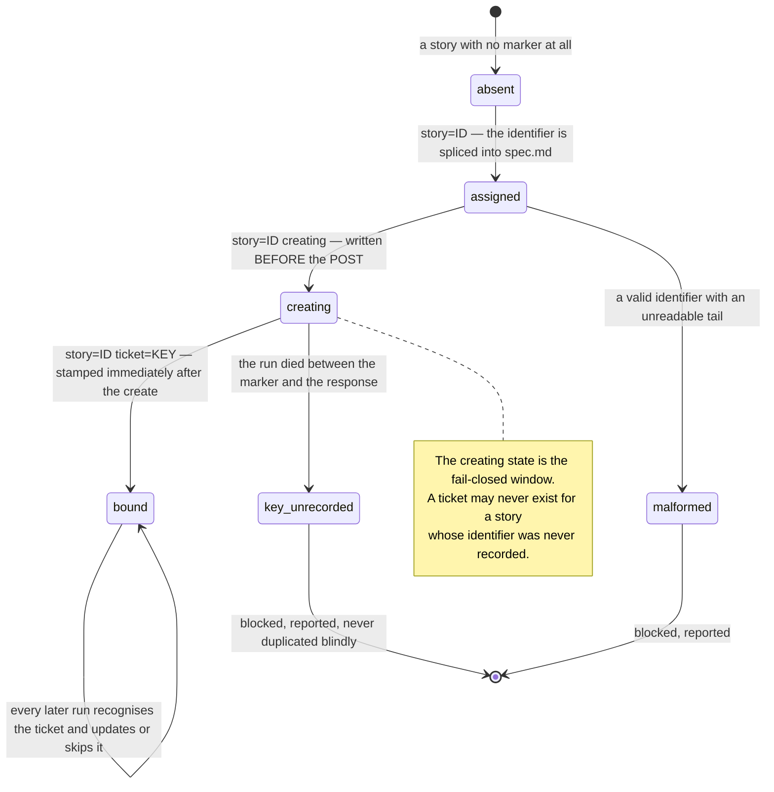
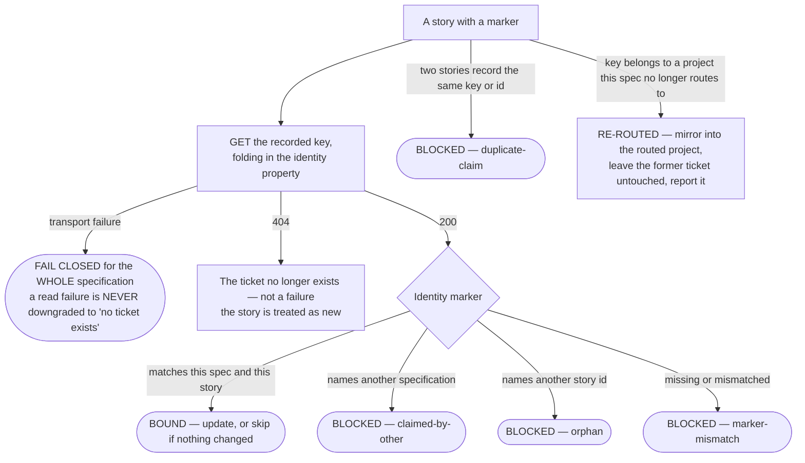
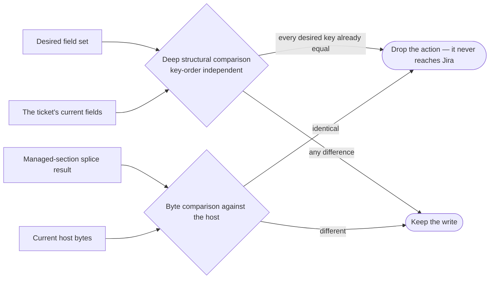
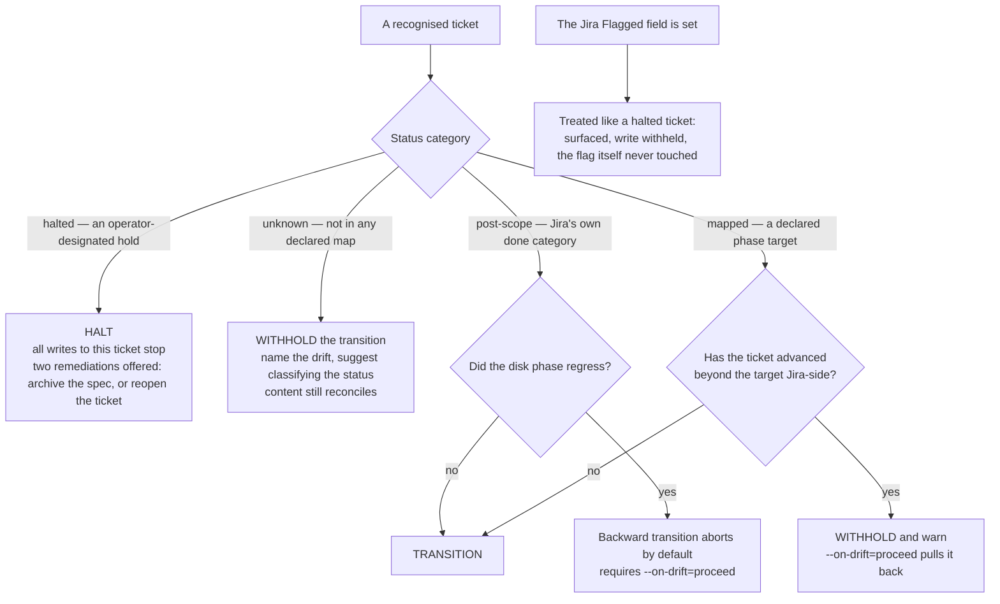
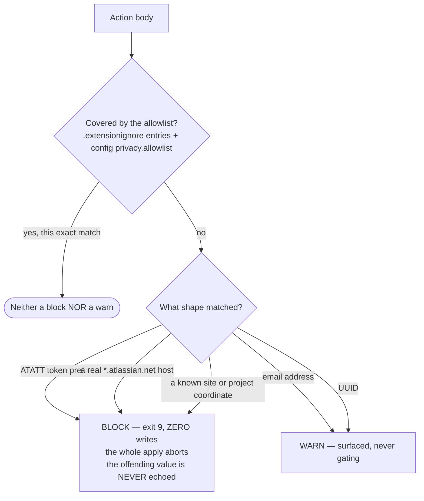
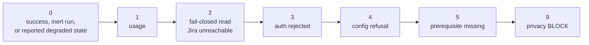
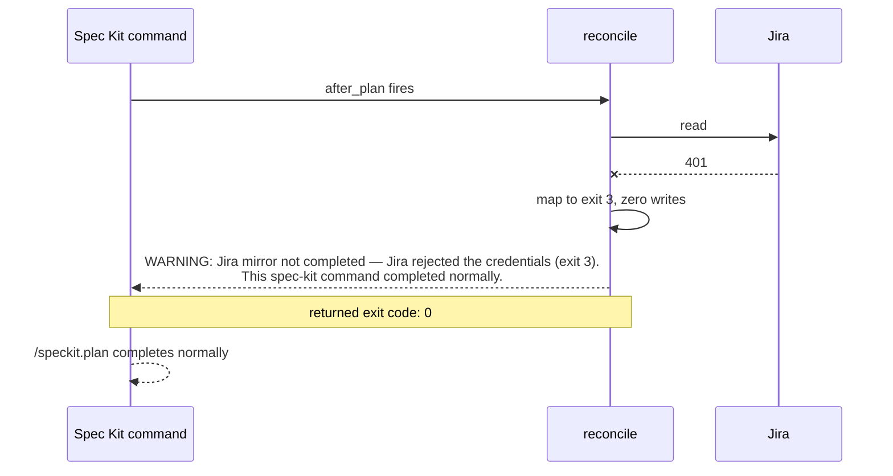

# 8. The safety model

Everything in this document exists to answer one question: *how does an
automatic, unattended mirror avoid making a mess of a team's Jira?*

## The story marker — durable identity on disk

Immediately after each `### User Story` heading (or after the document title,
for a specification with no such headings), reconcile writes exactly one HTML
comment line:

```markdown
<!-- speckit-jira story=7f3a9c1e40b2d85a ticket=PROJ-142 -->
```

The identifier is 16 lowercase hex characters — 8 bytes of cryptographic
randomness — assigned **once** and never recomputed. It survives a retitle, a
reorder, and a specification-folder rename.



Two ordering rules make this safe:

1. **Assignment is written before any Jira write.** If `spec.md` cannot be
   written, the run fails closed with zero Jira writes — no ticket may exist for
   a story whose identifier was never recorded.
2. **Each created key is stamped and recorded immediately, per ticket — never
   batched.** A run interrupted after three creations has three recorded keys.

A dry run computes the *same* assignment and never writes it, so the dry-run
report predicts the exact identifiers a following real run would use.

## Recognition — reading the ticket back before deciding anything

Recognition reads each recorded ticket **by key**, never by search: Jira's
search index is eventually consistent, and that consistency window is exactly
where the original duplicate-ticket defect lived.



The asymmetry is deliberate:

- An **inconclusive read** fails the whole specification closed. Guessing here
  would create a duplicate of every ticket.
- A **marker problem** blocks only the story it names. A blocked story is
  excluded from the write plan; its siblings reconcile normally and it never
  blocks them.

Nothing is ever moved or deleted on a re-route. The former ticket is left
exactly as it was, and the run summary says so in prose.

## Idempotency — zero churn, by construction



A re-run against an unchanged corpus must produce **zero** writes of every
kind: 0 created, 0 updated, 0 transitioned, 0 commented, 0 linked, 0 labeled.
The dropped-as-no-op count surfaces as `skipped` in the run summary. Identity
never keys on a mutable field — a title, a summary, or any operator-editable
display name — only on a server-side entity property and the on-disk marker.

## Drift — never silently overwriting Jira-side progress

Drift classification is pure engine code: zero Jira reads, zero writes. It
takes the ticket's current status, that status's category, the disk-inferred
target status, the operator's phase-ordered status sequence, and the
`--on-drift` mode, and returns one decision.



Three decisions, and what each means for content:

| Decision | Transition | Content writes |
|---|---|---|
| `transition` | emitted | yes |
| `withhold` | suppressed | **yes** — a withheld transition is not a suppressed update |
| `halt` | suppressed | **no** — the orphaned spec is surfaced for a human |

None of this machinery has a default table. `phase_status_map` and
`halted_statuses` are optional, hand-edited keys under a project entry in
`config.yml`: an operator's configured workflow is authoritative, and omitting
both keeps drift evaluation completely inert.

## The privacy guard — two tiers, precision over recall

Every content payload is scanned **before** any write. This is not a filter
applied to output; it is a gate placed in front of the write path.



The tiering is a design decision with a history: the original extension raised
BLOCK-tier false positives on ordinary Confluence links, and **a blocking
control with false positives ends up disabled**. So low-confidence shapes only
warn, and the allowlist exemption is evaluated **per match** — the payload is
never rewritten, so a broad or overlapping allowlist entry can only neutralise
the exact text it covers and can never disable detection of unrelated tokens.

## Exit codes — monotonically escalating



The table lives in one place (`lib/cli.sh` and its PowerShell twin) and is
asserted byte-identically across ports. A more severe failure never maps to a
lower code.

**And none of these ever becomes the host command's exit code.** Inside a hook,
a non-zero result is downgraded to `0` after a single actionable `WARNING`:



## Dry run — a prediction, not an approximation

Every write operation has a `--dry-run` whose report predicts **exactly** the
actions of the real run. The lifecycle filtering, the zero-churn dropping, and
the identifier assignment all run identically in both modes; only the HTTP
calls and the on-disk marker write are suppressed. A test for each write
operation runs `--dry-run` and then the real run against the same state and
asserts the two action sets are identical.
