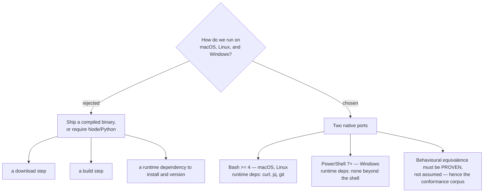
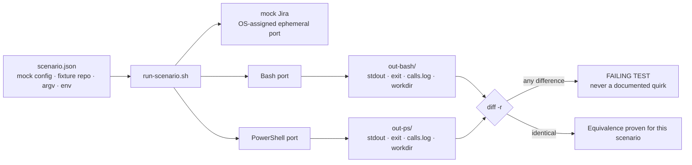
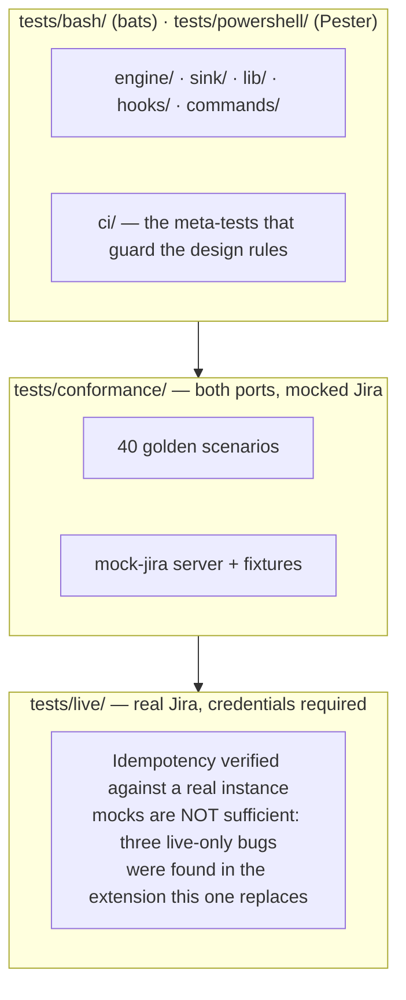
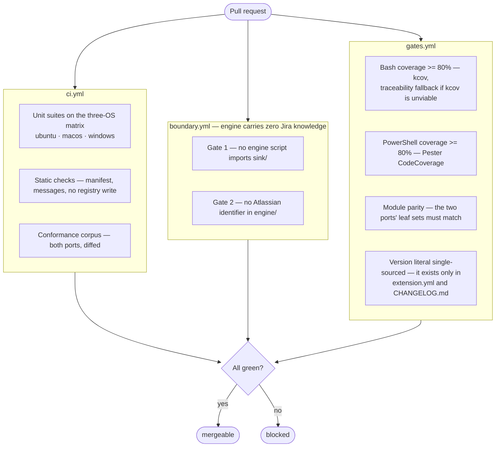
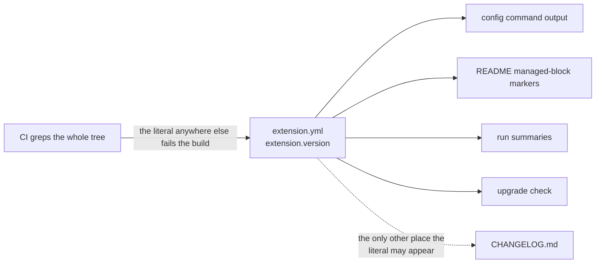
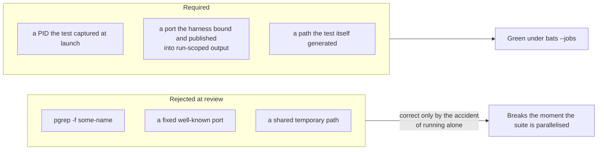

# 9. Twin ports and quality gates

Portability here is not achieved by a portable runtime. It is achieved by two
native implementations *proven* equivalent.

## Why two implementations



The cost of the chosen design is that every change has to land twice. The
benefit is that the extension is `git clone` away from running on any of the
three platforms, with no build and no download at any point.

## The conformance corpus — the equivalence proof

Forty language-agnostic golden scenarios, each a JSON file, run against **both**
ports by one harness. For identical inputs the two ports must produce a
byte-identical capture.



Four things are compared, not one:

| Capture | What it proves |
|---|---|
| `stdout` | identical run summaries, byte for byte |
| `exit` | identical exit codes |
| `calls.log` | identical Jira API call **sequence** |
| `workdir` | identical post-run repository tree |

The mock binds an **OS-assigned ephemeral port** and the harness injects the
resulting base URL, so scenarios never hard-code a port and concurrent runs
cannot collide.

## The test pyramid



The live suite runs on push to the default branch, on a schedule, and on a
maintainer-applied label — **never** as a blocking gate on pull requests from
forks, because GitHub Actions does not expose repository secrets to fork PRs.
Fork PRs are gated by the mocked suites, linting, and coverage.

## CI gates



Coverage is computed on the **mocked** suites only, so the gate stays
verifiable on fork PRs without credentials. Critical paths — drift decision,
idempotency, fail-closed, privacy guard, credential resolution — target
coverage close to 100%.

## The version, single-sourced



## Test isolation — a rule learned from a real defect

A conformance harness test once detected "leaked" mock processes with
`pgrep -f mock-server.ps1` — a name-pattern scan across the whole machine.
Under `bats --jobs` it matched *other* scenarios' mock servers running
concurrently and failed a passing test with no real leak.



The generalised rule, now part of the constitution: a test must identify every
piece of state it observes, asserts on, or cleans up by an identifier it
recorded from what it spawned or created — never by a name pattern or any
machine-wide scan.

## Running the suites locally

```sh
tests/run-bash.sh
pwsh -NoProfile -Command "Invoke-Pester -Path tests/powershell -PassThru"
```

`tests/run-bash.sh` requires only `bats` and `jq` — no PowerShell, no GNU
`parallel`. It shards one `bats` invocation per file across cores with
`xargs -P`, falling back to serial execution when concurrency is unavailable,
and never silently reports zero executed tests. Each test isolates its own
tmpdir and the mock binds an ephemeral port (or, for the Bash port, no port at
all — a scripted `curl` shim), so concurrent runs cannot collide. Use
`tests/run-bash.sh --since <ref>` for a change-scoped inner loop; it fails
open to the full suite on any doubt about what a diff affects.
