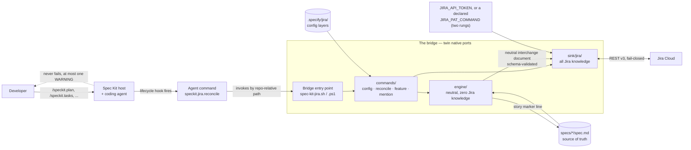

# spec-kit-jira — System Documentation

Visual documentation of what this Spec Kit extension does under the hood.
Every diagram is Mermaid, rendered natively by GitHub, GitLab, VS Code, and
most Markdown viewers.

The extension is a **bridge**: it mirrors a repository's spec-kit artifacts
(`spec.md`, `plan.md`, `tasks.md`) into Jira Cloud, automatically, on every
lifecycle step, without ever failing the spec-kit command that triggered it.

## The system in one picture

## Reading order

| # | Document | What it answers |
|---|----------|-----------------|
| 1 | [System context](01-system-context.md) | Who talks to what, and where each piece of state lives |
| 2 | [Module architecture](02-module-architecture.md) | The four layers, the engine/sink boundary, module-by-module map |
| 3 | [Lifecycle hooks](03-lifecycle-hooks.md) | How the extension gets wired in and when it fires |
| 4 | [The config ceremony](04-config-ceremony.md) | What `/speckit.jira.config` discovers and writes |
| 5 | [The reconcile flow](05-reconcile-flow.md) | The mirroring pipeline, step by step |
| 6 | [Feature naming](06-feature-naming.md) | Ticket-first branch and folder naming |
| 7 | [Configuration and secrets](07-configuration-and-secrets.md) | The three config layers and credential resolution |
| 8 | [The safety model](08-safety-model.md) | Idempotency, recognition, drift, privacy guard, exit codes |
| 9 | [Twin ports and quality gates](09-ports-and-quality.md) | Why there are two implementations and how they stay identical |
| 10 | [Windows portability](10-windows-portability.md) | The measured windows-latest quirks and the probe loop that established them |

Documents 1 to 10 describe what the bridge **is**. [VISION.md](VISION.md)
describes what it is meant to **become** — the whole feature surface once
every planned capability has shipped, with each item marked shipped,
specified, or merely envisioned. It is the backlog Principle XV points at, and
it authorises nothing on its own.

## The five rules that explain most of the design

Everything below is a consequence of these, taken from the project
constitution (`.specify/memory/constitution.md`):

1. **The filesystem is the source of truth.** Jira is a derived mirror. The
   bridge never deletes a Jira artifact and never silently regresses a ticket.
2. **Zero-churn idempotency.** A re-run over an unchanged spec produces zero
   Jira writes of any kind.
3. **Fail-closed on writes, non-blocking on hooks.** If Jira cannot be read
   reliably, nothing is written; but a hook never fails the host command — at
   worst one actionable `WARNING`.
4. **Neutral engine / Jira sink, separated by an interface.** The engine
   contains zero Jira knowledge; a schema-validated neutral document is the
   only thing that crosses the boundary. CI greps to prove it.
5. **Nothing about the Jira workflow is hard-coded.** Issue types, statuses,
   priorities, and custom fields are discovered through the API and mapped by
   logical name.
