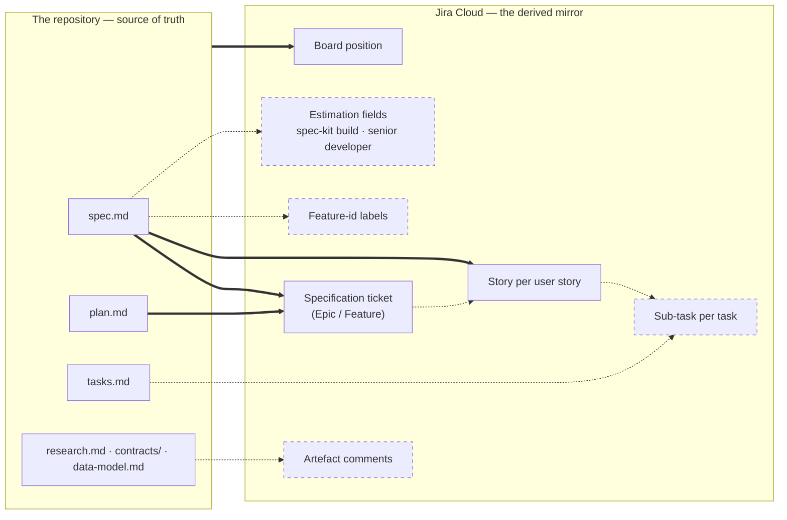

# Vision — where this bridge is going

This document describes the **finished** extension: everything the bridge is
meant to do once every planned capability has shipped. It exists so that a
contributor, a tech lead evaluating the extension, or a coding agent can see
the whole destination at once instead of inferring it from ten feature specs.

**This document is descriptive, never normative.** It authorises nothing. An
item listed here is a *candidate*, not a licence to write code: Principle XV
of the constitution (YAGNI — "nothing is built before a spec requires it")
means every capability below still has to travel through `/speckit.specify`,
earn its functional requirements, and pass the Constitution Check before a
single line of it exists. This file is the backlog that principle refers to —
it is deliberately kept out of the constitution, which is non-negotiable and
versioned, so that the roadmap can move without amending governance.

## The end state in one sentence

A team writes specifications; Jira reflects them — completely, continuously,
and without ever destroying what a human wrote there.

## Who it is for

**Both ends of the scale, with the same install.** A solo developer with one
Jira project, three issue types, and a two-column board must be able to run
`/speckit.jira.config` and be mirroring within minutes, without reading a
mapping reference. An enterprise running dozens of projects across several
teams, with custom fields, mandatory fields, bespoke workflows, and a
hierarchy several tiers deep, must be able to describe all of that in
`config.yml` and get the same guarantees.

Those two audiences are not served by two modes. They are served by one rule:
**nothing about the Jira workflow is hard-coded** (Principle VII). Issue types,
statuses, priorities, hierarchy roles, and custom fields are discovered
through the API and mapped by logical name. The small project declares almost
nothing and lets discovery derive the rest; the enterprise declares
everything, and a declaration always wins over a derivation. The distance
between the two is the length of one YAML file, not a different product.

The enterprise end of that scale has one recurring blocker: a project whose
issue types carry **mandatory custom fields** cannot be mirrored at all if the
bridge has nothing to put in them. Recording a default answer per field and
per issue type, at config time, so that ticket creation never blocks, is
*specified* and in flight (`specs/011-jira-field-defaults/`).

**Agile and SAFe, without picking a side.** The bridge has no opinion about
whether the tier above a story is called an Epic, a Feature, a Capability, or
a Service Category — it asks your project what it offers and maps the
`specification` / `story` / `task` roles onto the answer. A Scrum team, a
Kanban team, and an organisation running SAFe (the Scaled Agile Framework,
where planning spans program increments and several tiers of parent) all
configure the same three roles against different names. Statuses work the same
way: `phase_status_map` maps spec-kit lifecycle events onto *your* status
names, whatever your workflow calls them.

**`config.yml` is the whole contract.** It is committable, credential-free,
self-documenting, and written in business language rather than Jira internals
(Principle XVI): a tech lead reviews their team's mapping without opening the
documentation, and the resolved ids live elsewhere, in the gitignored local
binding. Every capability described below is expected to arrive as keys in
that file — configurable, and, where it writes to a field, switchable off.

## Status vocabulary

| Status | Meaning |
|--------|---------|
| **Shipped** | In both ports, covered by tests, documented |
| **Specified** | A spec exists under `specs/`; implementation in flight |
| **Envisioned** | Described here only. No spec, no code, no config key |

## The mirror surface, whole

Solid arrows are shipped. Dashed arrows and dashed boxes are the road ahead.

## Part 1 — What the bridge does today

Shipped, and described in detail in the [system documentation](README.md):

- **Mirrors a specification as a parent plus its children.** `spec.md` becomes
  one specification-level ticket (Epic, Feature, or whatever your project calls
  that tier) and one story per user story, with Gherkin acceptance criteria,
  design links, priority, and estimation. `plan.md` is summarised onto the
  parent. See [the reconcile flow](05-reconcile-flow.md).
- **Never hard-codes your workflow.** Issue types, statuses, priorities, and
  the estimation field are discovered through the Jira API and mapped by
  logical name, per project, including the three hierarchy roles
  (`specification` / `story` / `task`). See
  [the config ceremony](04-config-ceremony.md).
- **Advances the ticket on the board as the spec-kit lifecycle progresses.**
  `phase_status_map`, declared per project in `config.yml`, maps a lifecycle
  event (`after_specify`, `after_plan`, …) to one of your project's status
  names; `halted_statuses` names the states where the bridge must stop
  writing. Omit both and the machinery stays inert.
- **Refuses to overwrite Jira-side progress.** The drift engine compares the
  ticket's real status against the phase inferred from disk and withholds,
  halts, or transitions accordingly. See [the safety model](08-safety-model.md).
- **Preserves human-written description content forever.** On a ticket of human
  origin, generated content is confined to a delimited managed panel; every
  pre-existing line above it is byte-preserved, permanently, including after a
  human later edits it. On a bridge-created ticket the whole description is the
  managed panel, with no delimiters.
- **Adopts an existing, human-authored ticket** through the `mention` path: it
  reads the ticket's identity marker, refuses with zero writes if the ticket
  already belongs to another spec, fetches its content so the drafted spec
  starts informed, and thereafter treats the description as human-authored.
- **Names features ticket-first**, routes spec folders to projects, resolves
  configuration in three layers, keeps credentials out of the tree, guards
  privacy on every write, and supports a universal dry run.
- **Ships as twin native ports** — Bash and PowerShell 7+ — proven byte-
  equivalent by a shared conformance corpus.

## Part 2 — The road ahead

### 1. Tasks mirrored as sub-tasks

*Envisioned.* Each entry in `tasks.md` becomes a Jira sub-task under the story
it serves, so a developer sees on the board the same breakdown they see on
disk, and so time tracking and sprint boards operate at the granularity teams
actually work at.

What already exists to build on: the `task` hierarchy role is part of the
config schema and is resolved (never derived — it must be declared
deliberately), and sub-task issue types are already discovered per project.
What does not exist yet: the engine has **no `tasks.md` reader at all** — it
parses `spec.md` and summarises `plan.md`, nothing more. A neutral task
parser, an extension of the interchange document, and sub-task planning in the
sink are the substance of this work.

Open questions worth a clarification round: whether tasks that name no user
story get a sub-task at all; how phase markers and parallel-execution
annotations survive the crossing; and whether a very large `tasks.md` should
be mirrored in full or summarised, given Jira's practical limits.

### 2. Completion sync between a task and its story

*Envisioned.* When a task is finished, that fact appears in both places: the
sub-task moves to its done status, and the corresponding checklist entry in
the user story is ticked.

There are two defensible readings of "when a task is finished", and the choice
is a genuine design decision rather than a detail:

- **Disk-driven** — a checked box in `tasks.md` closes the sub-task. This is
  the reading that Principle I (the filesystem is the source of truth)
  favours, and it needs no new read path.
- **Jira-driven** — closing the sub-task in Jira ticks the box in `tasks.md`.
  This is a *write back to the repository*, which today happens only through
  the two controlled exceptions the constitution names. It would need a third,
  and therefore a constitutional amendment or a very carefully scoped
  exception.

Whichever direction wins, drift protection applies unchanged: the bridge must
never silently reverse a human's decision on either side.

### 3. Board advancement per lifecycle step

*Shipped* — see Part 1. `phase_status_map` and `halted_statuses` already give
each project its own mapping from spec-kit lifecycle event to status name,
and drift classification protects the result.

What remains, and is *envisioned*: the config ceremony does not yet
**discover** this mapping. Both keys are hand-edited today, which means a team
only benefits from them if someone reads the reconcile command's
documentation. Proposing a mapping at config time — "your project's statuses
are To Do, In Progress, In Review, Done; shall I map the lifecycle onto
them?" — would turn a documented feature into a default one.

### 4. Labels carrying the spec-kit identity

*Envisioned.* Every mirrored ticket carries a label naming its spec-kit
feature, so a Jira user can filter a board or write a JQL query — Jira's own
query language — down to one specification without knowing anything about
this extension.

What already exists: `ticket_create` accepts a labels argument and routing can
already match on labels. What does not: nothing in the reconcile path
populates it, so the parameter is presently unused.

Open questions: the exact label shape (a bare feature slug, or a namespaced
form that cannot collide with a team's existing labels); whether labels are
also removed when a spec is renamed, which touches "the bridge never deletes a
Jira artefact"; and whether label-based *adoption* — recognising a ticket a
human tagged by hand — arrives with this or stays separate. Adoption by label
is explicitly the second controlled exception the constitution anticipates,
and it deserves its own spec.

### 5. Automatic comments for the complementary artefacts

*Envisioned.* Artefacts that do not belong in a ticket description — the
research log, the interface contracts, the data model — are surfaced as
structured comments on the relevant ticket, so a Product Owner or a QA
engineer reading Jira knows they exist and where they live, without the
description turning into a document dump.

Two constraints shape this before any spec is written. First, idempotency:
Principle II demands that a re-run over unchanged artefacts produces **zero**
writes, so a comment has to be recognisable and updated in place — an
append-only comment stream would violate the principle on the second run.
Second, the privacy guard applies to comment bodies exactly as it does to
descriptions.

Open questions: one comment per artefact or one consolidated comment; whether
the comment carries a summary or only a pointer; and whether contracts belong
on the parent, on the story that consumes them, or on both.

### 6. Completing a ticket a human created, without overwriting them

*Shipped in substance* — the managed-panel splice and the `mention` adoption
path together already deliver this: a human's Story or Epic can be handed to
the extension, which then fills its own delimited region and leaves every
human-written byte alone, permanently.

What remains, and is *envisioned*: `mention` is implemented in both ports but
is **not exposed as an agent command** — `extension.yml` declares only
`speckit.jira.config`, `speckit.jira.feature`, and `speckit.jira.reconcile`.
So the capability exists and is tested, yet a user cannot reach it from their
agent. Surfacing it as `/speckit.jira.mention`, with the accompanying command
definition and lifecycle wiring, is the gap between "built" and "usable".

The neighbouring capability — adopting a ticket by **label** rather than by an
explicit mention — remains out of scope until specified.

### 7. Two estimations, side by side

*Envisioned.* A mirrored story carries two distinct, independently
configurable estimates:

- **The spec-kit build estimate** — what implementing this story through the
  spec-kit lifecycle is expected to cost, in the units the team already tracks.
- **The senior-developer estimate** — what the same story would cost a senior
  developer working conventionally, expressed in **story points or in
  person-days**, at the consumer's choice.

Carrying both is the point. A team adopting spec-driven development can see,
on its own board and in its own velocity numbers, what the method changes —
without that comparison being asserted by this extension, argued in a README,
or hidden in a tool nobody opens. The two figures sit next to each other in
Jira and let the team draw its own conclusion.

Everything about this is the consumer's decision, per project, in
`config.yml`: which Jira field receives each estimate, which unit each one
uses, and — importantly — **whether either is written at all**. Both fields are
switchable off, independently. A team that wants only the classic estimate
disables the other and sees exactly today's behaviour; a team that wants
neither disables both and the bridge never touches an estimation field. No
default table, no field invented on the team's behalf: same rule as
`phase_status_map`, which stays inert until an operator declares it.

What already exists to build on: `estimation_field` is discovered and
operator-confirmed at config time and stored by logical descriptor — including
the team-managed case, where the project's own field is used rather than the
global Story Points custom field — and the engine already parses a declared
estimation into the neutral document. What does not exist: a second estimate
anywhere in the chain, a unit notion (points versus person-days), and the
per-field enable switches.

One shipped constraint shapes the design and should not be discovered late:
estimation is **create-only** today (FR-018). It is written when a ticket is
created and never re-sent on update, precisely so that a Product Owner's
refinement in Jira is never overwritten. That protection is worth keeping for
the senior-developer figure — it is a human's number. Whether the spec-kit
build estimate should instead follow the spec as it evolves is a real question
for the clarification round, and it is the kind of question the drift engine
already knows how to answer for statuses.

The other open question is where the figures come from: a value declared in
`spec.md`, a value the coding agent proposes at planning time, or both with a
declared value winning. Only the first is available today.

## Part 3 — The longer backlog

Recorded in the "Out of Scope" section of the first specification and carried
forward here so it is not lost. All *envisioned*, none of them near-term:

- The guarded destructive prune (`re-mode`), for reconciling a spec whose
  stories have been deleted.
- Attachment and screenshot upload.
- Xray test-management integration.
- PI planning and goal linking, for organisations running SAFe (the Scaled
  Agile Framework).
- Release management: a git tag becoming a Jira version.
- An interactive assistant that asks a human for missing information rather
  than refusing — of which the recorded field defaults work
  (`specs/011-jira-field-defaults/`) is the first, narrow instalment.
- Sinks beyond Jira. The engine already contains zero Jira knowledge and the
  neutral interchange document is schema-validated, so a second sink is a
  matter of writing one — but, per Principle XV, only when a spec asks for it.

## Part 4 — How an item leaves this document

1. It earns a specification through `/speckit.specify`, with functional
   requirements and a Constitution Check.
2. Its plan justifies every new dependency, config key, and abstraction.
3. It ships in **both** ports, byte-equivalent under the conformance corpus.
4. Its entry here changes status, or is deleted once it is fully described by
   the system documentation.

An item that has been in this file for a long time without moving is not a
debt — it is a decision that has not become necessary yet, which is exactly
what YAGNI is for.
