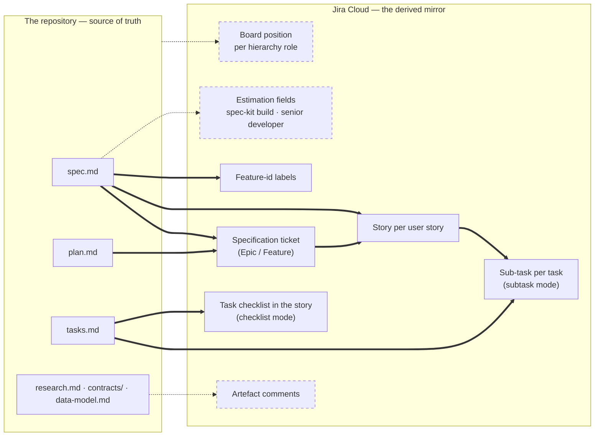

# Vision — where this bridge is going

This document describes the **finished** extension: everything the bridge is
meant to do once every planned capability has shipped. It exists so that a
contributor, a tech lead evaluating the extension, or a coding agent can see
the whole destination at once instead of inferring it from ten feature specs.

**This document is descriptive, never normative.** It authorises nothing. An
item listed here is a *candidate*, not a licence to write code: Principle XV
of the constitution (YAGNI — "nothing is built before a spec requires it")
means every capability below still has to travel through `/speckit.specify`,
earn its functional requirements, and pass the Constitution Check before a
single line of it exists. This file is the backlog that principle refers to —
it is deliberately kept out of the constitution, which is non-negotiable and
versioned, so that the roadmap can move without amending governance.

## The end state in one sentence

A team writes specifications; Jira reflects them — completely, continuously,
and without ever destroying what a human wrote there.

## Who it is for

**Both ends of the scale, with the same install.** A solo developer with one
Jira project, three issue types, and a two-column board must be able to run
`/speckit.jira.config` and be mirroring within minutes, without reading a
mapping reference. An enterprise running dozens of projects across several
teams, with custom fields, mandatory fields, bespoke workflows, and a
hierarchy several tiers deep, must be able to describe all of that in
`config.yml` and get the same guarantees.

Those two audiences are not served by two modes. They are served by one rule:
**nothing about the Jira workflow is hard-coded** (Principle VII). Issue types,
statuses, priorities, hierarchy roles, and custom fields are discovered
through the API and mapped by logical name. The small project declares almost
nothing and lets discovery derive the rest; the enterprise declares
everything, and a declaration always wins over a derivation. The distance
between the two is the length of one YAML file, not a different product.

The enterprise end of that scale used to have one recurring blocker: a project
whose issue types carry **mandatory custom fields** could not be mirrored at
all if the bridge had nothing to put in them. Recording a default answer per
field and per issue type, at config time, so that ticket creation never
blocks, has shipped (`specs/011-jira-field-defaults/`) — see Part 1.

**Agile and SAFe, without picking a side.** The bridge has no opinion about
whether the tier above a story is called an Epic, a Feature, a Capability, or
a Service Category — it asks your project what it offers and maps the
`specification` / `story` / `task` roles onto the answer. A Scrum team, a
Kanban team, and an organisation running SAFe (the Scaled Agile Framework,
where planning spans program increments and several tiers of parent) all
configure the same three roles against different names. Statuses work the same
way: `phase_status_map` maps spec-kit lifecycle events onto *your* status
names, whatever your workflow calls them.

**`config.yml` is the whole contract.** It is committable, credential-free,
self-documenting, and written in business language rather than Jira internals
(Principle XVI): a tech lead reviews their team's mapping without opening the
documentation, and the resolved ids live elsewhere, in the gitignored local
binding. Every capability described below is expected to arrive as keys in
that file — configurable, and, where it writes to a field, switchable off.

## Status vocabulary

| Status | Meaning |
|--------|---------|
| **Shipped** | In both ports, covered by tests, documented |
| **Specified** | A spec exists under `specs/`; implementation in flight |
| **Envisioned** | Described here only. No spec, no code, no config key |

## The mirror surface, whole

Solid arrows are shipped. Dashed arrows and dashed boxes are the road ahead.

## Part 1 — What the bridge does today

Shipped, and described in detail in the [system documentation](README.md):

- **Mirrors a specification as a parent plus its children.** `spec.md` becomes
  one specification-level ticket (Epic, Feature, or whatever your project calls
  that tier) and one story per user story, with Gherkin acceptance criteria,
  design links, priority, and estimation. `plan.md` is summarised onto the
  parent. See [the reconcile flow](05-reconcile-flow.md).
- **Never hard-codes your workflow.** Issue types, statuses, priorities, and
  the estimation field are discovered through the Jira API and mapped by
  logical name, per project, including the three hierarchy roles
  (`specification` / `story` / `task`). See
  [the config ceremony](04-config-ceremony.md).
- **Mirrors the task list, as sub-tasks or as a checklist.** With `task_mirror`
  set to `subtask`, every recognisable line of `tasks.md` becomes a Jira
  sub-task under the story it serves, carrying its own durable identifier, and
  checking a task off transitions that sub-task to whichever status the
  project's workflow classifies as done. With `checklist`, the same task list
  rides the story's own description as a checklist — 6 issues instead of 106
  for a feature of 5 stories and 100 tasks, and no sub-task issue type
  required. See [the reconcile flow](05-reconcile-flow.md).
- **Refuses to overwrite Jira-side progress.** The drift engine compares the
  ticket's real status against the phase inferred from disk and withholds,
  halts, or classifies accordingly. `phase_status_map`, declared per project in
  `config.yml`, maps a lifecycle event (`after_specify`, `after_plan`, …) to one
  of your project's status names; `halted_statuses` names the states where the
  bridge must stop writing. Omit both and the machinery stays inert. **What the
  drift engine decides, it does not yet act on** at the specification and story
  tiers — see Part 2, item 3. See [the safety model](08-safety-model.md).
- **Skips a run that has nothing to do, and says where the time went.** A
  reconcile whose `spec.md`, `tasks.md` and configuration are unchanged since
  the last fully successful run exits in under a second having issued zero
  requests; `SPEC_KIT_JIRA_TIMING=1` reports, on stderr only, how long each of
  the eight pipeline phases took and how many requests it issued. Recognition
  reads recorded tickets in bulk — one request per hundred keys rather than one
  per ticket — the token is resolved once per process, and the run's local work
  is batched rather than spawned per item. See
  [the reconcile flow](05-reconcile-flow.md).
- **Preserves human-written description content forever.** On a ticket of human
  origin, generated content is confined to a delimited managed panel; every
  pre-existing line above it is byte-preserved, permanently, including after a
  human later edits it. On a bridge-created ticket the whole description is the
  managed panel, with no delimiters.
- **Adopts an existing, human-authored ticket** through the `mention` path: it
  reads the ticket's identity marker, refuses with zero writes if the ticket
  already belongs to another spec, fetches its content so the drafted spec
  starts informed, and thereafter treats the description as human-authored.
- **Records a default for a mandatory custom field, once, so a mirror never
  blocks.** A project whose written issue types require a field beyond what
  the bridge supplies used to be refused outright; the config ceremony now
  asks about each required field once, per project, and the answer is
  spliced into `config.yml`'s `field_defaults` managed region. A creating
  reconcile run asks a consolidated question before writing when a recorded
  default is about to land or a required field is still unsatisfiable, and
  is otherwise silent — a team that recorded nothing sees no change at all.
  See [the config ceremony](04-config-ceremony.md) and
  [the reconcile flow](05-reconcile-flow.md).
- **Names features ticket-first**, routes spec folders to projects, resolves
  configuration in three layers, keeps credentials out of the tree, guards
  privacy on every write, and supports a universal dry run.
- **Ships as twin native ports** — Bash and PowerShell 7+ — proven byte-
  equivalent by a shared conformance corpus.

## Part 2 — The road ahead

### 1. Tasks mirrored as sub-tasks

*Shipped* — see Part 1 (`specs/012-jira-task-subtasks/`), with a second
mirroring mode added by `specs/022-story-task-checklist/`. Each entry in
`tasks.md` becomes either a Jira sub-task under the story it serves or a
checklist entry inside that story's own description, chosen per project with
one line of `config.yml`. The open questions this entry once recorded were all
answered by those two specs: a task naming no user story mirrors nothing and is
reported once by its reference; the sub-task tier keeps `files`, `depends_on`,
`parallel` and the task's durable identifier as metadata bullets, and the
checklist tier deliberately keeps only the entry's text and completion state;
and the answer to a very large `tasks.md` is the checklist mode, which costs one
issue for the whole list.

Nothing here is *envisioned* any more, and this entry stays only until the
system documentation is the single place a reader looks for it.

### 2. Completion sync between a task and its story

*Shipped in the disk-driven direction* — a checked box in `tasks.md` moves its
sub-task to whichever status the project's workflow classifies as done
(`specs/012-jira-task-subtasks/`), and in checklist mode the entry inside the
story's description is ticked (`specs/022-story-task-checklist/`). A task
reverting from checked to unchecked never pulls its sub-task backward on its
own: the divergence is reported by key and moves only under
`--on-drift=proceed`.

What remains, and is *envisioned*, is the other direction: **Jira-driven** —
closing the sub-task in Jira ticks the box in `tasks.md`. That is a *write back
to the repository*, which today happens only through the two controlled
exceptions the constitution names. It would need a third, and therefore a
constitutional amendment or a very carefully scoped exception. Drift protection
would apply unchanged: the bridge must never silently reverse a human's
decision on either side.

### 3. Board advancement per lifecycle step

*Specified, not shipped* — `specs/023-advance-board-position/`.

`phase_status_map` and `halted_statuses` already give each project its own
mapping from spec-kit lifecycle event to status name, and drift classification
already decides, per recognised ticket, whether the mirror should advance,
withhold, or halt. **No ticket at the specification or story tier is ever moved
on the board**, in any circumstance: the decision is reached and the machinery
stops there. The sub-task tier is the exception — checking a task off does
transition its sub-task — and it is the shape the specified work generalises.

Two further gaps the spec records, both invisible on a green run:

- **The mapping has no notion of tier.** It is declared once per project and
  evaluated only against story-tier tickets. An Epic and a Story rarely share a
  workflow, so one mapping cannot describe both; the spec makes the mapping
  declarable per hierarchy role.
- **The lifecycle event does not reach the bridge.** The mapping is keyed by
  event, and nothing in the extension manifest or the agent-facing reconcile
  procedure tells the bridge which event fired — so on the real path the
  declared status is always empty and drift evaluation is never reached at all.
  Every scenario that exercises it does so through a test-only override.

Still *envisioned* beyond that spec: the config ceremony does not **discover**
this mapping. Both keys are hand-edited today, which means a team only benefits
from them if someone reads the reconcile command's documentation. Proposing a
mapping at config time — "your project's statuses are To Do, In Progress, In
Review, Done; shall I map the lifecycle onto them?" — would turn a documented
feature into a default one, and it becomes more valuable, not less, once there
is one mapping per role.

### 4. Labels carrying the spec-kit identity

*Shipped* — `specs/017-fix-duplicate-tickets/`. Every ticket the mirror manages
carries `speckit-<folder>`, so a Jira user filters a board or writes a JQL
query — Jira's own query language — down to one specification without knowing
anything about this extension. The label is additive: it is merged with any
label the project's configuration already sends and with any label an operator
applied by hand, and the mirror never removes one it did not add. A ticket whose
write is suppressed is not labelled either — the label follows the write and is
never an exception to a hold.

One of the questions this entry recorded was answered by that spec: the shape is
the folder-derived slug, namespaced by the `speckit-` prefix. What a
specification-folder rename should do with the label the previous name produced
was not decided there and is still open — it touches "the bridge never deletes a
Jira artefact".

Still *envisioned*: label-based **adoption** — recognising a ticket a human
tagged by hand. That is explicitly the second controlled exception the
constitution anticipates, and it deserves its own spec.

### 5. Automatic comments for the complementary artefacts

*Envisioned.* Artefacts that do not belong in a ticket description — the
research log, the interface contracts, the data model — are surfaced as
structured comments on the relevant ticket, so a Product Owner or a QA
engineer reading Jira knows they exist and where they live, without the
description turning into a document dump.

Two constraints shape this before any spec is written. First, idempotency:
Principle II demands that a re-run over unchanged artefacts produces **zero**
writes, so a comment has to be recognisable and updated in place — an
append-only comment stream would violate the principle on the second run.
Second, the privacy guard applies to comment bodies exactly as it does to
descriptions.

Open questions: one comment per artefact or one consolidated comment; whether
the comment carries a summary or only a pointer; and whether contracts belong
on the parent, on the story that consumes them, or on both.

### 6. Completing a ticket a human created, without overwriting them

*Shipped in substance* — the managed-panel splice and the `mention` adoption
path together already deliver this: a human's Story or Epic can be handed to
the extension, which then fills its own delimited region and leaves every
human-written byte alone, permanently.

What remains, and is *envisioned*: `mention` is implemented in both ports but
is **not exposed as an agent command** — `extension.yml` declares only
`speckit.jira.config`, `speckit.jira.feature`, and `speckit.jira.reconcile`.
So the capability exists and is tested, yet a user cannot reach it from their
agent. Surfacing it as `/speckit.jira.mention`, with the accompanying command
definition and lifecycle wiring, is the gap between "built" and "usable".

The neighbouring capability — adopting a ticket by **label** rather than by an
explicit mention — remains out of scope until specified.

### 7. Two estimations, side by side

*Envisioned.* A mirrored story carries two distinct, independently
configurable estimates:

- **The spec-kit build estimate** — what implementing this story through the
  spec-kit lifecycle is expected to cost, in the units the team already tracks.
- **The senior-developer estimate** — what the same story would cost a senior
  developer working conventionally, expressed in **story points or in
  person-days**, at the consumer's choice.

Carrying both is the point. A team adopting spec-driven development can see,
on its own board and in its own velocity numbers, what the method changes —
without that comparison being asserted by this extension, argued in a README,
or hidden in a tool nobody opens. The two figures sit next to each other in
Jira and let the team draw its own conclusion.

Everything about this is the consumer's decision, per project, in
`config.yml`: which Jira field receives each estimate, which unit each one
uses, and — importantly — **whether either is written at all**. Both fields are
switchable off, independently. A team that wants only the classic estimate
disables the other and sees exactly today's behaviour; a team that wants
neither disables both and the bridge never touches an estimation field. No
default table, no field invented on the team's behalf: same rule as
`phase_status_map`, which stays inert until an operator declares it.

What already exists to build on: `estimation_field` is discovered and
operator-confirmed at config time and stored by logical descriptor — including
the team-managed case, where the project's own field is used rather than the
global Story Points custom field — and the engine already parses a declared
estimation into the neutral document. What does not exist: a second estimate
anywhere in the chain, a unit notion (points versus person-days), and the
per-field enable switches.

One shipped constraint shapes the design and should not be discovered late:
estimation is **create-only** today (FR-018). It is written when a ticket is
created and never re-sent on update, precisely so that a Product Owner's
refinement in Jira is never overwritten. That protection is worth keeping for
the senior-developer figure — it is a human's number. Whether the spec-kit
build estimate should instead follow the spec as it evolves is a real question
for the clarification round, and it is the kind of question the drift engine
already knows how to answer for statuses.

The other open question is where the figures come from: a value declared in
`spec.md`, a value the coding agent proposes at planning time, or both with a
declared value winning. Only the first is available today.

### 8. Running under a GitHub cloud agent

*Envisioned.* The bridge is designed today around a developer at a terminal,
with a shell profile, an OS secret manager, and someone available to answer a
question. Increasingly the spec-kit lifecycle runs somewhere else entirely: a
GitHub cloud agent — the Copilot coding agent, a coding agent running in
Actions, and their neighbours — picks up an issue, drives `/speckit.specify`
through `/speckit.implement` unattended, and opens a pull request. The bridge
has to mirror just as faithfully there, with nobody watching.

Part of this already works, by design rather than by accident. Credential
resolution is **environment-first** (`JIRA_API_TOKEN`, then the OS secret
manager, then the gitignored `.env`), so an Actions secret or a Codespaces
secret resolves without a Keychain or a keyring existing at all — and the
token still never reaches argv, logs, or a trace. The non-blocking hook rule
means a bridge failure cannot break the agent's run. The universal dry run
gives a safe first execution in an unfamiliar environment.

What is missing is everything that assumes a human:

- **No non-interactive mode.** The config ceremony asks questions, and a
  creating reconcile run asks its own consolidated question when a mandatory
  field's value is still unsettled (`specs/011-jira-field-defaults/`). With
  nobody at the prompt, each of those has to resolve from committed
  configuration or refuse cleanly — never hang, never guess. `--accept-defaults`
  already gives the field-defaults question a non-interactive answer; the
  config ceremony's own questions (project key, style, role mapping) still
  need the same treatment.
- **The marker write-back has to survive the pull request.** Reconcile splices
  durable story identifiers into `spec.md` — that is one of the two controlled
  exceptions to "the filesystem is the source of truth", and the whole
  recognition design rests on it. In a cloud agent that mutation lives on the
  agent's branch and must be committed and reach the PR. If it is lost, the
  next run does not merely lose state: it stops recognising the tickets and
  creates duplicates, the exact defect this extension was built to fix. This is
  the sharpest risk of the whole item.
- **Concurrency is unaddressed.** Zero-churn idempotency protects a re-run over
  unchanged content; it says nothing about two agents on two pull requests
  mirroring into the same project at the same moment. Whether that needs
  ordering, a lock, or simply a create path that tolerates a lost race is an
  open design question.
- **Which Jira account the agent authenticates as** is a decision worth making
  explicitly rather than inheriting. A dedicated bot account keeps the audit
  trail readable and keeps the bridge-versus-human origin discrimination
  meaningful — a human's words are only protected if "human" still means
  something.
- **The non-blocking rule may want an opt-in inverse.** Inside a hook, a
  failure is one actionable `WARNING` and the host command still succeeds; that
  is Principle III and it is right for a developer mid-flow. In an automated
  pipeline, a warning nobody reads is worse than a red check. A strict mode,
  opted into per environment, would serve CI without touching the principle
  that governs interactive runs.
- **Prerequisites must be established on the runner, not assumed.** Bash ≥ 4,
  `curl`, `jq`, and `git` are a given on a developer's configured machine and
  are not a given on every runner image.

This item is the "CI / headless execution" entry the first specification
recorded as out of scope, grown up: it is no longer a convenience for pipelines
but the environment a growing share of spec-kit work happens in.

### 9. A choice of transport: the REST API or the Jira MCP server

*Envisioned.* `/speckit.jira.config` asks one more question — how should the
bridge reach Jira? — and the consumer answers **the Jira REST API**, as today,
or **the Jira MCP server**, Atlassian's implementation of the Model Context
Protocol (MCP), the open protocol through which a host exposes tools and data
to an agent. The answer is recorded once; everything downstream is unchanged.

The appeal is not novelty, it is credentials and governance. An organisation
that has already sanctioned the Atlassian MCP server has already settled its
authentication, its consent screen, and its audit trail centrally. Asking each
developer to also mint a personal API token, and asking this extension to
carry it through a Keychain, a keyring, or a gitignored `.env`, duplicates a
decision that was already made — and duplicates the risk that comes with it.
Over MCP, the token this extension handles most carefully is a token it never
holds at all.

Note what this is *not*: MCP is a second **transport to the same sink**, not a
second sink. The Jira knowledge stays exactly where it is. Sinks beyond Jira
(Part 3) are a different axis entirely.

Architecturally this is more plausible than it sounds, because the seam
already exists. `sink/jira/client.sh` and its PowerShell twin are the **single
HTTP conduit** to Jira: every other module in the sink goes through them, and
the engine above has zero Jira knowledge at all. A second transport is a
second implementation behind one existing interface, not a rewrite.

What that client owns, and what any second transport must reproduce exactly:

- **The outcome mapping.** `2xx` → success, `401`/`403` → auth, `404`, `5xx`,
  network failure, and an exhausted retry budget → fail-closed, with **nothing
  on stdout** so a caller capturing a body sees the empty result of a failed
  read. Principle III's fail-closed guarantee is that mapping; a transport that
  reports failure differently makes the guarantee unverifiable rather than
  merely different.
- **The bounded retry budget**, honouring `Retry-After` on a 429.
- **The credential discipline** — whatever an MCP session uses in place of a
  Basic header must be as absent from argv, logs, and traces as the token is.

The sharpest question, and the one that decides whether this item is feasible
at all, should be answered before anything else is designed: **does the MCP
tool surface expose issue entity properties?** A bridge ticket's identity
lives in a server-side entity property under the key `spec-kit-jira` —
deliberately not a label and not the summary, because entity properties are
stable, hidden from the editable UI, and survive a spec-folder rename. Every
recognition read resolves that marker. If it cannot be read and written over
MCP, the bridge stops recognising its own tickets and recreates them: the
duplicate-ticket defect this extension was built to fix, reintroduced through
a new door. Behind it sit the same questions for issue-creation metadata and
required fields (on which the shipped field-defaults work depends), available
transitions, ADF description writes, and per-project issue-type and status
discovery.

Then a design question worth settling early, because the tempting answer is
the expensive one. MCP is spoken between a host and a server, and in this
setting the host is usually the coding agent. So either **the bridge becomes
an MCP client itself** — JSON-RPC from Bash and PowerShell, a real lift, but
the script stays the actor and stays deterministic — or **the bridge delegates
the calls to the agent** that already holds the connection. The second shape
is much less work and costs the property the whole design rests on: the script
is deterministic and the agent merely invokes it. Put a language model in the
write path and zero-churn idempotency, byte-equivalence between the ports, and
the meaning of a dry run all become unverifiable. The preference is the first
shape.

Two constraints to carry into the spec:

- **Never a silent fallback.** If the selected transport cannot perform an
  operation, the bridge fails closed and names the reason. It must never quietly
  reach for the REST token an operator believed was out of the picture.
- **The conformance corpus needs a second double.** Today the Bash port's Jira
  is a scripted `curl` replacement and the PowerShell port's is a mock server;
  an MCP transport needs its own, and the two ports still have to be proven
  byte-equivalent through it.

Where the answer is recorded is a smaller open question with a real edge: the
transport looks like a **local binding** concern — this machine has an MCP
server configured, that one does not — yet an organisation may want to mandate
it for everyone. Most likely both layers participate: the team may pin a
transport in `config.yml`, and a developer selects one locally when the team
has not.

## Part 3 — The longer backlog

Recorded in the "Out of Scope" section of the first specification and carried
forward here so it is not lost. All *envisioned*, none of them near-term:

- The guarded destructive prune (`re-mode`), for reconciling a spec whose
  stories have been deleted.
- Attachment and screenshot upload.
- Xray test-management integration.
- PI planning and goal linking, for organisations running SAFe (the Scaled
  Agile Framework).
- Release management: a git tag becoming a Jira version.
- An interactive assistant that asks a human for missing information rather
  than refusing, beyond the mandatory-custom-field case already shipped
  (`specs/011-jira-field-defaults/`, see Part 1).
- Sinks beyond Jira. The engine already contains zero Jira knowledge and the
  neutral interchange document is schema-validated, so a second sink is a
  matter of writing one — but, per Principle XV, only when a spec asks for it.

## Part 4 — How an item leaves this document

1. It earns a specification through `/speckit.specify`, with functional
   requirements and a Constitution Check.
2. Its plan justifies every new dependency, config key, and abstraction.
3. It ships in **both** ports, byte-equivalent under the conformance corpus.
4. Its entry here changes status, or is deleted once it is fully described by
   the system documentation.

An item that has been in this file for a long time without moving is not a
debt — it is a decision that has not become necessary yet, which is exactly
what YAGNI is for.
