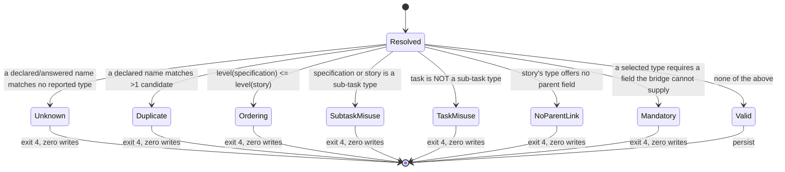

# Phase 1 Data Model — The Operator Declares Which Issue Types Carry the Mirror

**Feature**: `specs/010-jira-hierarchy-mapping/` | **Date**: 2026-08-02

Three layers hold state, and the boundary between them is Constitution V:

| Layer | File | Owner | Holds |
| --- | --- | --- | --- |
| Team config | `.specify/jira/config.yml` | Humans, committed | The **declaration** — role → issue type *name* |
| Local binding | `.specify/jira/config.local.yml` | The ceremony, gitignored | The **resolution** — names, ids, levels, provenance |
| Secrets | `.specify/jira/.env` | The operator, gitignored | Untouched by this feature |

---

## 1. Role — the neutral vocabulary

A closed set of three. Engine-side; contains nothing Jira-specific.

| Role | Repository artifact | Mirrored |
| --- | --- | --- |
| `specification` | One `spec.md` | Today |
| `story` | One user story inside it | Today |
| `task` | One task inside a user story | Phase 8 only (§7) |

**Validation**: any other key inside a `hierarchy` mapping is refused (FR-030).
The set is declared once per port and consumed everywhere, following the
precedent of `JIRA_HOOK_EVENT_NAMES` (`lib/config.sh`), which exists so the
closed set of lifecycle events has exactly one source.

---

## 2. Hierarchy declaration — committed layer

```
projects:
  - key: PROJ
    hierarchy:
      specification: Epic
      story: Story
      task: Sous-tâche        # optional; see §7
```

| Field | Type | Required | Rule |
| --- | --- | --- | --- |
| `hierarchy` | object | no | Absent ⇒ derivation, exactly as today (FR-004) |
| `hierarchy.<role>` | string | no | Non-empty; matched against the project's reported `logical_name` verbatim (FR-003) |

**Schema errors** added to `_CFG_TEAM_ERRORS_JQ` / its PowerShell twin:

| Condition | Message |
| --- | --- |
| `hierarchy` not an object | `projects[N].hierarchy must be a mapping of role to issue type name` |
| key ∉ role set | `projects[N].hierarchy declares unknown role \`X\`; the roles are specification, story, task` |
| value not a non-empty string | `projects[N].hierarchy.<role> must be a non-empty issue type name` |

Rendered per `contracts/role-mapping.md` §6.1. The `config: ` prefix is added by
the caller (`commands/config.sh:421`), and the array index rather than the
project key is the schema layer's existing convention — it validates before any
project is bound.

**Not validated here**: whether the named type exists, its level, or its
sub-task flag. Those need the project's metadata and belong to §5 — the schema
layer never talks to Jira.

**Credential shape**: no new code. `_cfg_credential_errors` already scans every
scalar path outside `privacy` in both layers, so a token-shaped or host-shaped
value under `hierarchy` is refused with exit `4` and never echoed (FR-003).
Asserted by test, not assumed.

**Not enforced by syntax**: "names, not identifiers". `10701` is a legal issue
type *name*, and a digits-rejecting rule would be a compiled-in assumption about
Jira naming (Constitution VII). A declared identifier is caught structurally
instead — the resolver matches `logical_name` only, so it falls into the
unknown-type refusal of §5 with the candidate list attached.

---

## 3. Resolved role binding — local layer

Per project, under `resolved_ids.<KEY>.roles.<role>`:

| Field | Type | Notes |
| --- | --- | --- |
| `logical_name` | string | The name the project reported |
| `id` | string | The project's issue type id |
| `hierarchy_level` | string | **String, not number** — the YAML round-trip has no number type (`commands/config.sh:97-101`). Compared with `tonumber` / `[int]` |
| `subtask` | boolean | The project's flag; authoritative for §5's sub-task rules — never inferred from the level |
| `source` | enum | `declared` \| `operator` \| `derived` |

```
resolved_ids:
  PROJ:
    roles:
      specification: {logical_name: Epic,       id: "10701", hierarchy_level: "1",  subtask: false, source: declared}
      story:         {logical_name: Story,      id: "10703", hierarchy_level: "0",  subtask: false, source: operator}
      task:          {logical_name: Sous-tâche, id: "10704", hierarchy_level: "-1", subtask: true,  source: declared}
    child_type:  {logical_name: Story, id: "10703", source: operator}   # mirror of roles.story
    parent_type: {logical_name: Epic,  id: "10701", source: declared}   # mirror of roles.specification
    issue_types: [...]        # unchanged
    required_fields: {...}    # unchanged
    parent_link_available: {} # unchanged
    style / style_source      # unchanged
```

**Dual-write, single-read (research R5).** `child_type` and `parent_type` are
written in lockstep with `roles.story` and `roles.specification` and remain the
keys `_reconcile_plan_context` and `hierarchy_mandatory_gate` read. `roles` is
the authoritative record of what was resolved and why; the two legacy keys are
the compatibility surface that keeps the reconcile path, the stale-binding
detector (`return 6` / `return 7`) and both ports' write tests untouched.

Recorded in the plan's Complexity Tracking with its removal trigger.

**Local schema errors** added to `_CFG_LOCAL_ERRORS_JQ`:

| Condition | Message |
| --- | --- |
| `roles` not an object | `resolved_ids.K.roles must be a mapping` |
| key ∉ role set | `resolved_ids.K.roles declares unknown role \`X\`` |
| `source` ∉ enum | `resolved_ids.K.roles.<role>.source is invalid` |

Mirrors the existing `style_source` validation exactly.

---

## 4. Resolution — precedence and provenance (FR-006)

One resolver, invoked once per project, over all roles:

```
for role in specification, story, task:
    candidates ← the project's non-sub-task types (or sub-task types, for `task`)

    1. committed  projects[].hierarchy.<role>   → source: declared
    2. operator   --issue-type KEY=role=name    → source: operator
       (--child-type KEY=name is the accepted alias for role=story)
    3. derivation, only when the role's level holds exactly one candidate
                                                → source: derived
    else → unresolved
```

**Supersession (FR-007)**: a committed declaration outranks a recorded local
answer. The binding converges onto the declaration on the next run and the
summary names both types. One-time; subsequent runs are unchanged (Constitution
II).

**Derivation, unchanged from 008 where it applies**:

- `story` — the lowest `hierarchy_level` over non-sub-task types.
- `specification` — the lowest level strictly above the story level.
- `task` — never derived. A project with one sub-task type is not evidence the
  team wants a task tier (§7). Undeclared and unanswered, it is **absent**, not
  unresolved (`contracts/role-mapping.md` §3.4).

**Ordering fix (research R1)**: all roles resolve in one pass and unresolved
roles accumulate. Today the specification tier's refusal aborts before the story
tier is examined, so a consumer with two ambiguous tiers learns one per run.

---

## 5. Mapping validation — the state machine

Runs after resolution, before any write, in both the ceremony and reconcile
(FR-021).



| State | FR | Rule | Message names |
| --- | --- | --- | --- |
| Unknown | FR-013 | name ∉ candidates | role, declared value, every candidate |
| Duplicate | FR-019 | name matches >1 candidate | role, name, the level |
| Ordering | FR-014 | `level(spec) > level(story)` fails | both roles, both types, both levels |
| SubtaskMisuse | FR-015 | `subtask` true for spec/story | role, type |
| TaskMisuse | FR-016 | `subtask` false for task | role, type |
| NoParentLink | FR-017 | `parent_link_available[story.id]` false | project, story type name |
| Mandatory | FR-018 | existing gate, over every selected type | type, unsatisfiable field names |

**Deliberately absent**: any adjacency requirement (FR-012 permits a gap), any
cap on the gap, and any inference of "sub-task" from a level. The `subtask`
flag is authoritative; the level is not. A project reporting a sub-task type at
level 0 is handled correctly by the flag rule and would be mishandled by a level
rule.

**Reuse**: NoParentLink and Mandatory are the existing checks
(`hierarchy_parent_link_unavailable_message`, `hierarchy_mandatory_gate`). What
changes is *when* — pulled to configuration time — and *over what* — every type
the mapping selects, including one derivation would never have chosen (FR-018).

---

## 6. Unresolved-role question — the reportable object

Emitted on the FR-009 refusal, in the `--json` summary, so the agent renders a
closed enumeration instead of re-parsing prose (research R7).

| Field | Type | Notes |
| --- | --- | --- |
| `project` | string | The project key |
| `role` | enum | Which role is unresolved |
| `level` | string | The reported level whose candidates these are |
| `candidates` | array | `{logical_name, id}`, in discovered order — the **sole** option list |
| `declaration` | string | `projects[].hierarchy.<role>` — what to commit |
| `flag` | string | `--issue-type KEY=role=<name>` — the one-off answer |

Emitted through `lib/output.sh`, never a bare `jq` — it is multi-line JSON and
the Windows jq build emits CRLF on multi-line output (research R10).

FR-008 (the closed question) and FR-009 (the non-interactive refusal) are the
**same code path**; only the consumer of the output differs. This is the
existing project-key pattern (`commands/config.sh:479-489`).

---

## 7. The `task` role before Phase 8

Declared and persisted from Phase 3, validated from Phase 6, mirrored only from
Phase 8. Phase numbers
here and throughout this document are `tasks.md`'s, which is authoritative for
ordering; `plan.md` numbers the same work by layer as stages A–F.

| Phase | Declaration | Validation (FR-016) | Persisted | Sub-tasks created |
| --- | --- | --- | --- | --- |
| 1–7 | accepted | yes | yes | **no** — reported as `recorded, not yet mirrored` |
| 8 | accepted | yes | yes | yes |

An **undeclared** `task` role is a third case, and not one this table covers: it
is absent rather than unresolved, produces no `roles.task` and no refusal, and
leaves the run identical to a two-role one (`contracts/role-mapping.md` §3.4).

The status line is not decoration. Without it a team commits
`hierarchy.task: Sous-tâche`, sees no error, and reasonably concludes sub-tasks
are being created. A declared-but-unbuilt role must say so (research R9).

FR-024 is the invariant on both sides of the boundary: **no `task` role resolved
⇒ output byte-for-byte identical to today.**

---

## 8. What this feature does not touch

`issue_types`, `required_fields`, `parent_link_available`, `priorities`,
`statuses`, `style`, `style_source`, `estimation_field_id`, `site_alias`,
`overrides`, `hooks.disabled` — all unchanged in shape and in meaning. The
neutral interchange document is unchanged for User Stories 1–4; a task tier
would extend it in Phase 8.
