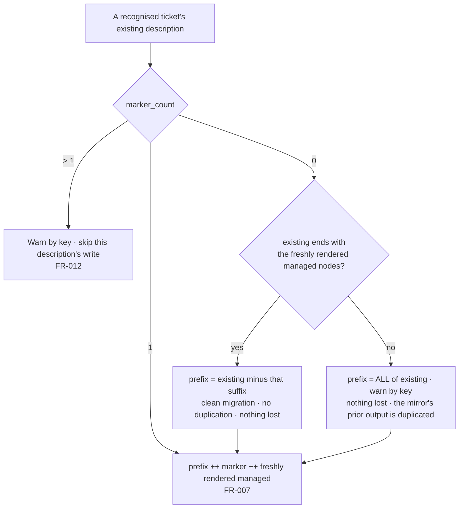

# Data model — the ownership boundary and the summary record

Every structure below is either an existing one gaining a field, or a new pure-engine return shape. No new
file format, no new configuration key, no new persisted location.

## 1. The description, as two regions

A mirrored ticket's description is one rich-text document whose top-level content array splits into two
regions at a single delimiter node.

```
description.content = [ human prefix … ] ++ [ marker node ] ++ [ managed nodes … ]
                        └─ never written ─┘  └────── replaced in full on every write ──────┘
```

| Region | Owner | Read by the mirror | Written by the mirror |
|---|---|---|---|
| Human prefix | The human | Yes — to preserve it verbatim | Never |
| Marker node | The mirror | Yes — to locate the split | Yes, re-emitted on every write |
| Managed nodes | The mirror | No — recomputed from the specification | Yes, replaced in full |

The marker node is a single strong paragraph carrying the text
`Synced from spec-kit — do not edit below this line` (`adf_managed_marker`). It is unchanged from the
adopted-ticket case; this feature does not introduce a second delimiter, a second wording, or a
configurable one.

**Boundary shape**: the boundary has a top and no bottom. Text a human places *after* the managed nodes is
inside the region the mirror replaces and does not survive. This matches the shipped adopted-ticket
behaviour exactly; the marker's own wording is what tells a human where to type.

### Managed node order (unchanged)

`_adf_content_nodes` emits, in this fixed order: description body blocks, then the acceptance panel with
its heading, then the Design section. For the specification-role parent the body ends with the plan
section, because `reconcile.sh` appends the plan blocks to `epic.description.blocks` and the parent carries
neither acceptance criteria nor design. No ordering change is required by this feature (research R2).

## 2. Split results — two engine return shapes

Both are pure, canonical, and free of any tracker vocabulary. The marker is a parameter.

### `managed_section_panel_split <marker>` — extended

```jsonc
{
  "prefix":       [ /* nodes before the first marker-bearing node */ ],
  "managed":      [ /* that node and everything after it */ ],
  "had_marker":   true,
  "marker_count": 1        // NEW — the number of nodes carrying the marker
}
```

`marker_count` is the only addition. `had_marker` is retained (it is `marker_count > 0`) so no existing
caller changes shape.

| `marker_count` | Meaning | Caller's obligation |
|---|---|---|
| `0` | No boundary yet | Fall through to the migration split (§3) |
| `1` | Well-formed | Ordinary render: `prefix ++ marker ++ managed` |
| `> 1` | Malformed | Warn by ticket key, skip this description's write entirely (FR-012) |

### `managed_section_suffix_split <managed-nodes>` — new

Stdin is the existing content-node array; the argument is the freshly rendered managed node array.

```jsonc
{
  "prefix":  [ /* existing minus the matched suffix, or ALL of existing on no match */ ],
  "matched": true          // false when the existing content does not end with <managed-nodes>
}
```

Pure structural array comparison, no marker, no tracker knowledge. Used only on the migration path.

## 3. Description resolution — one decision per recognised ticket



A **creation** has no existing description, so it takes the `marker_count == 0`, no-match branch with an
empty existing array: prefix is empty and the result is `marker ++ managed`. Every ticket the mirror
creates from this release onward therefore carries the boundary from its first byte.

## 4. Churn — decided on the managed region alone

`plan_managed_description_status` (already shipped) splits both the current and the desired description at
the marker and compares only the `managed` portions. This feature makes it the **universal** path rather
than the human-origin-only one.

| Change | Description churn? | Rationale |
|---|---|---|
| Specification edited | Yes | The managed region differs (FR-008) |
| Plan produced, changed, or deleted | Yes | The plan section lives in the managed region (FR-002/FR-004) |
| Human edited the prefix | **No** | The managed region is identical (FR-009) |
| Human deleted the managed region | Yes | It is restored in full (FR-008) |
| Nothing changed | No | FR-005, Constitution II |

The migration write of §3 is itself a change — the current description carries no marker, the desired one
does — so it fires exactly once per ticket and the run after it reports zero (FR-021).

## 5. The identity marker — one new field

Existing shape (`identity_marker`), with the addition marked:

```jsonc
{
  "origin":    "bridge" | "human",
  "repo":      "<repo ref>",
  "spec_slug": "<spec folder identifier>",
  "role":      "parent" | "story" | "task",   // omitted when the caller supplies none
  "story":     "<durable story identifier>",  // omitted when absent
  "summary":   "<the summary this mirror last SENT>"   // NEW — omitted when none was ever sent
}
```

- **Raw, not normalised.** What is recorded is the exact string the payload carried; normalisation applies
  only to the comparison (§6).
- **Omitted, never empty.** An absent field is the "no record" state, matching how `role` and `story`
  already express absence, and keeping a marker written by a previous release valid.
- **`identity_claimed_by_other` is unaffected** — it compares `repo` and `spec_slug` only.

**When it is written**: after a create, and after an update whose payload actually carried a `summary`
field. Never otherwise. That binding is what keeps zero-churn intact: a settled mirror sends no summary,
so it sends no property write.

## 6. Summary drift — the decision, per recognised ticket

Comparison is on a normalised form of both sides — trim leading and trailing whitespace, collapse internal
whitespace runs to a single space — because the tracker normalises summaries server-side.

| Recorded `summary` | Normalised current vs recorded | `--on-drift` | Desired fields carry `summary`? | Warning |
|---|---|---|---|---|
| absent | — | any | Yes | None (FR-018) |
| present | equal | any | Yes, when it differs from the specification's title | None (FR-017) |
| present | different | `abort` (default) | **No** — the field is omitted | One, naming the ticket key and the summary field (FR-015) |
| present | different | `proceed` | Yes | The overwrite is reported as an ordinary update (FR-016) |

Omitting the field rather than suppressing the whole write is what lets every other field of that ticket
reconcile normally, as US3 scenario 5 requires. The existing zero-churn comparison
(`idempotency_field_status`) only inspects keys present in the desired object, so an omitted `summary`
needs no further special-casing.

## 7. Plan context — new entries

`_reconcile_plan_context` gains two maps beside the existing `ticket_descriptions`, both keyed by local id
and both omitted entirely when empty (the neighbouring convention):

| Key | Value | Source |
|---|---|---|
| `ticket_summaries` | the ticket's current Jira summary | `recog.bound[*].current.summary` (already read) |
| `ticket_last_summaries` | the recorded last-written summary | `recog.bound[*].last_summary` (new, from the identity marker) |

And one existing map changes meaning:

| Key | Before | After |
|---|---|---|
| `ticket_origins` | populated only for a non-`bridge` origin, so the delimited path was unreachable for bridge tickets | populated for **every** recognised ticket |

The lifecycle context's matching `origin` omission (`reconcile.sh:1176`) is removed for the same reason.

## 8. Privacy scan scope

| Payload part | Scanned | Why |
|---|---|---|
| Summary, labels, priority, every non-description field | Yes, unchanged | The mirror composes it |
| The managed region's nodes | Yes, unchanged | The mirror composes it |
| The marker node | Yes, unchanged | The mirror composes it |
| The preserved human prefix | **No** | Verbatim round-trip: read from this ticket, written back to this ticket (research R4) |

The exemption is per-region and structural — it is not an allowlist entry, cannot be configured, and cannot
be widened by a consumer.

## 9. Run summary — what a reader sees

No new count and no new key. The behaviours introduced here surface through the existing channels:

| Situation | Where it appears |
|---|---|
| A migration write | `counts.updated` (or `counts.tasks.updated` for a sub-task) |
| An ambiguous migration | `warnings`, naming the ticket key |
| A malformed boundary | `warnings`, naming the ticket key |
| A human's rename withheld | `warnings`, naming the ticket key and the summary field |
| A rename overwritten under `--on-drift=proceed` | `counts.updated` |
| Everything settled | zero everywhere |
