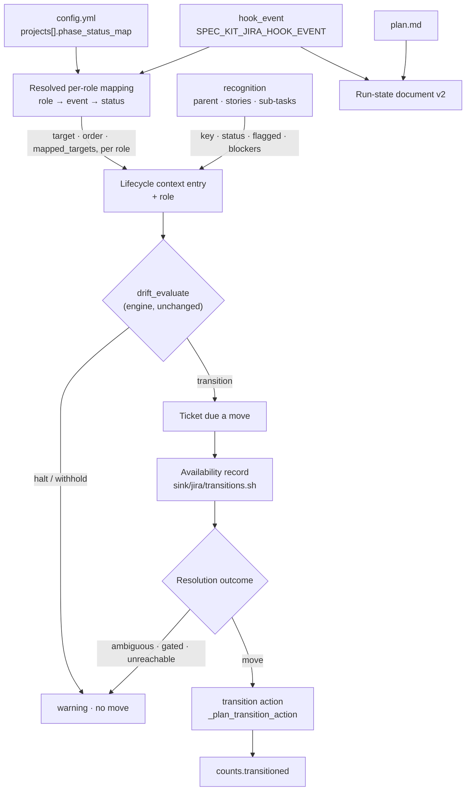

# Data model — Each Tier Advances Along Its Own Declared Workflow

Five entities. Two are existing documents that gain members; three are new and live only inside one run.
Every JSON shape below is canonical (`json_canonical` / the PowerShell twin): sorted keys, compact, raw
UTF-8, no trailing newline, byte-identical between ports.

---

## 1. The per-role lifecycle mapping

**Where**: `projects[].phase_status_map` in `.specify/jira/config.yml` — the committable team layer, beside
the mapping it extends. Normative shape and validation: [`contracts/role-lifecycle-config.md`](./contracts/role-lifecycle-config.md).

**Two accepted shapes**, discriminated by the key set (research R3):

```yaml
# Legacy — every key is a lifecycle event. Means the STORY role. Unchanged meaning (FR-020).
phase_status_map:
  after_specify: "To Do"
  after_plan: "In Progress"

# Per role — every key is a hierarchy role.
phase_status_map:
  specification:
    after_plan: "Building"
  story:
    after_specify: "To Do"
    after_plan: "In Progress"
  task:
    after_implement: "Done"
```

**Resolved form** — what `_reconcile_phase_status_map` hands downstream after normalisation. Both input
shapes produce this one shape, so every consumer has a single case to handle:

```json
{"specification":{"after_plan":"Building"},
 "story":{"after_specify":"To Do","after_plan":"In Progress"},
 "task":{}}
```

| Field | Type | Meaning |
| --- | --- | --- |
| `<role>` | object | One of `specification`, `story`, `task`. Always all three keys, empty object where the project declares nothing for that role — so a consumer never distinguishes absent from empty. |
| `<role>.<event>` | string | The status name this role's tickets should stand at once that lifecycle event has happened. Written in the team's vocabulary; never compared against any built-in list. |

**Derived, per role, once per run** (never per ticket — FR-029):

| Derived value | From | Used by |
| --- | --- | --- |
| `target` | `<role>[<hook_event>]`, or `""` | The step this run aims for, for tickets of that role |
| `order` | the distinct values of `<role>`, in lifecycle-event order | `drift_evaluate`'s advance/regress comparison |
| `mapped_targets` | the set of values of `<role>` | classifying a ticket's own status as `mapped` |

`halted_statuses` stays project-wide and is **not** part of this entity (spec Assumptions): a status name
only matches tickets actually standing at it, so one list covering three workflows behaves correctly.

---

## 2. The run-state document, version 2

**Where**: `.specify/jira/state/<feature-dir>.json`, gitignored by its own sibling `.gitignore` containing
`*`. Owner: `lib/run_state.sh` / `RunState.psm1`. Normative decision table:
[`contracts/run-state-v2.md`](./contracts/run-state-v2.md).

Delta against 021's schema 1 — everything not listed is unchanged:

| Field | Type | Change | Meaning |
| --- | --- | --- | --- |
| `schema` | integer | `1` → **`2`** | The set of recorded inputs changed, so every existing document is invalidated. That is 021's own rule for this kind of change, and invariant S7's guarantee for an upgrade. |
| `hook_event` | string | **new** | The lifecycle event this run was dispatched for; `""` for a direct invocation. Recorded verbatim, exactly as `on_drift` and `field_values` already are — it is a run input, not a file. |
| `inputs["plan.md"]` | string | **new** | `git hash-object` of the sibling `plan.md`, present only when the file exists. It is already read on every run and spliced onto the parent (`commands/reconcile.sh:861`), so a change to it must invalidate. |

Full field list after the change: `schema`, `extension_version`, `base_url`, `email`, `on_drift`,
`hook_event`, `field_values`, `inputs`. `inputs` members: `spec.md` (always), `plan.md`, `tasks.md`,
`.specify/jira/config.yml`, `.specify/jira/config.local.yml`, `.specify/jira/personal.yml` (each present
only when the file exists, so appearing and disappearing both invalidate).

**Matching stays byte-equality** of a freshly composed document against the recorded one. There is no
per-field match and no repair — the property that makes the short-circuit auditable and identical between
ports.

**Never in this document**: a credential, in any field, in any form. `hook_event` is a member of a closed
set of six lifecycle constants.

---

## 3. The availability record

Produced by `sink/jira/transitions.sh` for one ticket. It is the tracker's answer, normalised — never a
judgement about it.

```json
{"key":"PROJ-142",
 "moves":[{"id":"21","to":"In Progress","gated_field":null},
          {"id":"31","to":"In Review","gated_field":{"logical_name":"Resolution","field_id":"resolution"}}]}
```

| Field | Type | Meaning |
| --- | --- | --- |
| `key` | string | The ticket the answer belongs to. Matched back to the request case-insensitively, never by position. |
| `moves[].id` | string | The identifier the tracker will accept to perform this move. Opaque. |
| `moves[].to` | string | The name of the step this move lands on, spelled as the tracker spells it. The **only** thing compared against a declared step. |
| `moves[].gated_field` | object or null | The first field this move's own screen marks required. `null` when completing the move demands nothing of the mirror. |

`moves` is ordered as the tracker returned it and that order is never used for a decision (FR-002) — it is
preserved only so a warning naming several candidates reads the same on both ports.

**Reachable set** is not stored: it is `[.moves[].to]`, computed where a warning needs it.

---

## 4. The resolution outcome

Pure function of an availability record and one declared step name. Four shapes, one per branch of the rule
the task tier already settled — see [`contracts/transition-resolution.md`](./contracts/transition-resolution.md) §3.

| Outcome | Shape | What the run does |
| --- | --- | --- |
| `move` | `{"outcome":"move","transition_id":"21"}` | Emits the transition action; counts one moved |
| `ambiguous` | `{"outcome":"ambiguous","candidates":[{"id","name"},…]}` | No move; one warning naming every candidate |
| `gated` | `{"outcome":"gated","gated_field":{"logical_name","field_id"}}` | No move; one warning naming the demanded value |
| `unreachable` | `{"outcome":"unreachable","reachable":["In Review","Done"]}` | No move; one warning naming current step, declared step, and what is reachable |

There is deliberately **no** `already_there` outcome: a ticket standing at the declared step never reaches
resolution, because no availability read is issued for it (FR-008, FR-026).

`candidates` carries the move's own `name` — used **only** in the warning text, never in the decision.

---

## 5. The lifecycle context entry, and the run summary

### Lifecycle context (existing, gains two members)

Consumed by `plan_lifecycle` (`sink/jira/plan_apply.sh:1003–1005`). One entry per recognised ticket, keyed
by its durable local identifier:

| Field | Change | Meaning |
| --- | --- | --- |
| `role` | **new** | `specification`, `story`, or `task`. Decides which mapping, order and target apply to this ticket, and appears in every warning. |
| `target` | existing, now per role | The declared step for this run's event **on this ticket's role**. Empty leaves every rule inert, exactly as today. |
| `transition_id` | existing, now filled on the real path | Set from a `move` outcome. Empty for the other three, which now also carry a warning rather than a silent drop. |
| `key`, `current`, `status`, `category`, `flagged`, `blockers` | unchanged | As today. `category` is now classified against **this role's** mapped targets. |

The context gains one entry for the **parent** (research R6), which requires
`_recognition_read_parent`'s field projection to widen from `summary,description,labels` to include
`status`, `issuelinks` and `Flagged`. The prefetch's requested union already carries all three
(`sink/jira/prefetch.sh:26`); only the projection changes.

### Run summary counts

| Field | Presence | Meaning |
| --- | --- | --- |
| `counts.transitioned` | **new** — present only when the run carries a lifecycle event **and** at least one role declares a step for it | Tickets moved at the specification and story tiers. Never folded into `created` or `updated`: a move is a position change, not a content change. |
| `counts.tasks.transitioned` | unchanged | The task tier's own moved count, keeping its current name, place and meaning (012). |

The conditional presence is required, not stylistic: spec FR-011 demands byte-identical output for a run
with no event, and 012 FR-011 set the same precedent for `counts.tasks` — absence, never a zeroed object,
is the off switch.

---

## Entity relationships



Two directions are load-bearing and worth stating in words. The availability read hangs off **`Due`**, not
off `Recog` — nothing is asked of the tracker for a ticket the safety rules did not send there. And
`drift_evaluate` sits above the sink entirely: it decides *whether*, the sink decides *how*, and the engine
never learns what a transition is.
