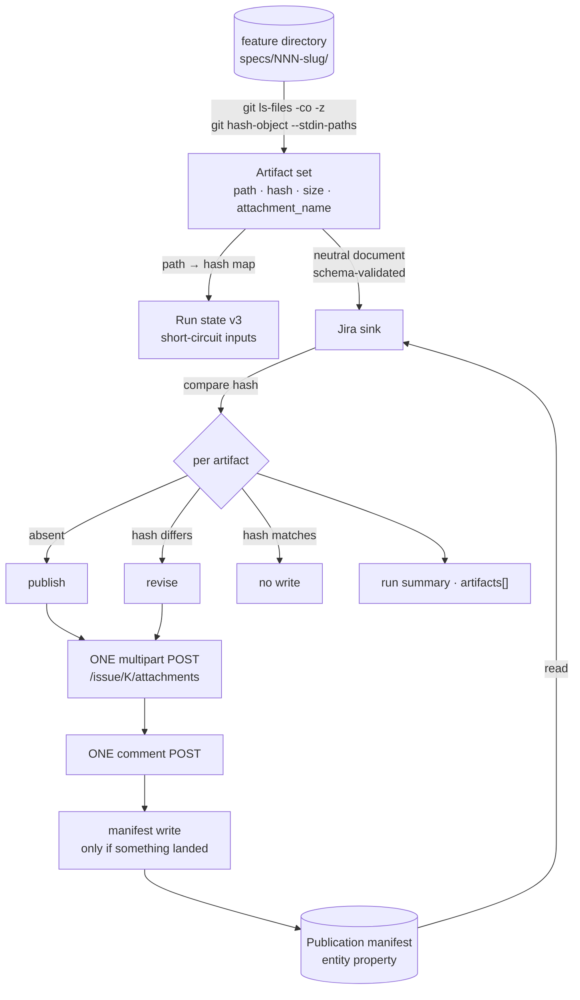

# Phase 1 — Data model: Publish every feature artifact on the specification ticket

**Feature**: `036-attach-feature-artifacts` | **Date**: 2026-08-31

Five objects. Two are new documents (§1, §2), one is an existing document whose
shape changes (§3), one is an extension of the neutral interchange document
(§4), and one is the summary the operator reads (§5).

---

## 1. Artifact set — the engine's view of the feature directory

Built by the engine. Contains **no Jira knowledge**: it is a list of paths and
hashes, and it would be identical if the sink were something other than Jira.

| Field | Type | Rule |
|-------|------|------|
| `path` | string | Path relative to the feature directory, `/`-separated on every host. The key of the set; unique within it. |
| `hash` | string | `git hash-object --no-filters` of the file's bytes. |
| `size` | integer | Bytes on disk. Used only by the size gate (FR-017). |
| `attachment_name` | string | The flattened name of R7: `path` with `/` replaced by `__`. |

**Construction** (one process each, R4/R5):

1. `git ls-files --cached --others --exclude-standard -z -- <feature dir>` →
   the path list, NUL-separated, ignore rules already applied.
2. The same list on stdin to `git hash-object --no-filters --stdin-paths` →
   the hashes, one per line, in input order.
3. `size` from a single stat pass; `attachment_name` is a pure string transform.

**Ordering**: the set is sorted by `path`, byte-wise, before anything consumes
it. Both ports must produce the same order or every downstream artifact —
the manifest, the comment body, the call sequence — diverges (Principle VI).
`git ls-files` output order is not contractual; the sort is.

**Validation**:

- A `path` escaping the feature directory (`..`) is impossible from `ls-files`
  scoped to that directory, and is rejected if it appears.
- Two entries with the same `attachment_name` are a **collision**: both are
  withheld, one warning names both paths (R7, FR-005).
- An entry whose `size` exceeds the discovered upload limit is **oversized**:
  it is withheld, one warning names the path, its size and the limit (FR-017).

Withheld entries stay in the set, marked, so the summary can report them
(FR-021). They are never written to the manifest.

---

## 2. Publication manifest — the cross-machine record

A Jira **entity property** on the specification ticket, key
`spec-kit-jira-artifacts`. Schema: `contracts/artifact-manifest.schema.json`.

```json
{
  "schema": 1,
  "artifacts": {
    "spec.md":            { "hash": "<git-oid>", "attachment_id": "10021", "run": "after_plan" },
    "contracts/api.md":   { "hash": "<git-oid>", "attachment_id": "10022", "run": "after_plan" }
  }
}
```

| Field | Type | Rule |
|-------|------|------|
| `schema` | integer | `1`. A change to the *shape* bumps it; an unknown value is treated as "no manifest" and the run republishes. |
| `artifacts` | object | Keyed by `path`. One entry per artifact **currently** published — never a history. |
| `.hash` | string | The hash last successfully published for that path. |
| `.attachment_id` | string | The Jira attachment id returned for that publication. Lets FR-012 re-derive against the ticket's real attachment list. |
| `.run` | string | The lifecycle event that published it. Diagnostic only. |

**Lifecycle**:

- Read once, at the start of publication, from the specification ticket.
- Compared against the artifact set: an entry absent from the manifest is a
  **first publication**; an entry whose `hash` differs is a **revision**; an
  entry whose `hash` matches is **unchanged** and produces no write.
- Written back **only when at least one artifact was published**, and only with
  the entries that actually landed. A run that publishes nothing issues no
  property write — this is what keeps FR-009 true down to zero writes of every
  kind.
- A path present in the manifest but absent from the artifact set (the file was
  deleted) is **left in place**. Its attachment still exists on the ticket
  (FR-015) and the manifest still describes it correctly.

**Why bounded**: one entry per path, not per publication. Forty runs over ten
artifacts is ten entries, not four hundred.

**Trust rule (FR-012)**: the manifest is a cache, not the truth. When the
ticket's attachment list does not contain an `attachment_id` the manifest
claims, that entry is treated as unpublished and republished. This is what
recovers an interrupted run whose property write landed but whose upload did
not, or the reverse.

---

## 3. Run state — schema 2 → 3

`.specify/jira/state/<feature>.json`, `lib/run_state.sh` / `RunState.psm1`.

**What changes**: `inputs` stops being the three fixed keys `spec.md`,
`tasks.md`, `plan.md` and becomes the artifact set's path → hash map in full.

```json
{
  "schema": 3,
  "inputs": {
    "spec.md": "<oid>", "plan.md": "<oid>", "tasks.md": "<oid>",
    "research.md": "<oid>", "contracts/api.md": "<oid>"
  },
  "base_url": "…", "email": "…", "on_drift": "…",
  "hook_event": "after_plan", "field_values": "…", "extension_version": "…"
}
```

| Rule | Detail |
|------|--------|
| Bump | `_RUN_STATE_SCHEMA` 2 → 3. Every existing file is invalidated, so the first run after upgrade does work — which is correct, it has artifacts to publish. |
| Key set | Exactly the artifact set's paths. No key is omitted for an absent file, because a file that is absent is not in the set at all. |
| Ordering | Canonical JSON, keys sorted — as today, via `json_canonical`. |
| Consequence | A change to *any* artifact invalidates the state and the run proceeds. FR-011 is this line. |

The three previously special-cased inputs lose their special case entirely.
`plan.md` is still read and spliced onto the parent description by reconcile;
that is unchanged and unrelated.

---

## 4. Neutral interchange document — the artifact set crosses the boundary

The engine builds the artifact set; the sink turns it into attachments and a
comment. It therefore crosses the engine→sink interface and must travel in the
neutral document, schema-validated before any write (Principle VIII).

Added to `contracts/neutral-interchange.schema.json`:

```json
"artifacts": {
  "type": "array",
  "items": {
    "type": "object",
    "required": ["path", "hash", "size", "attachment_name"],
    "properties": {
      "path":            { "type": "string" },
      "hash":            { "type": "string" },
      "size":            { "type": "integer", "minimum": 0 },
      "attachment_name": { "type": "string" }
    },
    "additionalProperties": false
  }
}
```

The field is **optional** in the schema: a document built before any artifact
exists, or by a code path that does not publish, omits it. It carries no
absolute path — a path relative to the feature directory is a neutral fact; an
absolute one would leak the operator's home directory into a document that gets
written to disk and compared byte-for-byte across ports.

**The sink resolves the real file path** from the feature directory plus
`path`, at upload time. The engine never hands the sink a filesystem handle.

---

## 5. Action set and run summary

Two new action kinds join `create` / `update` / `transition` / `comment` /
`link` / `label` in the sink's planned action set (`sink-interface.md`):

| Kind | Payload | Dry-run rendering |
|------|---------|-------------------|
| `attach` | ticket ref, the artifact entries to upload | names every artifact and its attachment name |
| `comment` | ticket ref, the composed body | reproduces the body verbatim |

`comment` is already declared in the sink-interface contract and in the
endpoints contract, and has no implementation; this feature is its first
consumer.

**Summary** (`contracts/run-summary.schema.json`) gains one array:

```json
"artifacts": [
  { "path": "spec.md",          "action": "published",  "attachment_name": "spec.md" },
  { "path": "contracts/api.md", "action": "unchanged" },
  { "path": "assets/demo.mov",  "action": "withheld", "reason": "oversized", "size": 41943040, "limit": 10485760 },
  { "path": "checklists/api.md","action": "withheld", "reason": "name-collision", "collides_with": "contracts/api.md" }
]
```

`action` is one of `published` · `revised` · `unchanged` · `withheld`. A
`withheld` entry always carries a `reason` and the facts the operator needs to
act (FR-021, Principle XVI). Under `--dry-run` the same array is produced with
`would-publish` / `would-revise` in place of the two write actions — the
existing `would-` convention (`commands/feature.sh:1088`).

**Note**: `run-summary.schema.json` is documentation only — no code reads it,
and it has drifted behind both ports before. The tasks must update it *and* the
guard that compares it to the ports' real output, or it drifts again.

---

## Relationships


